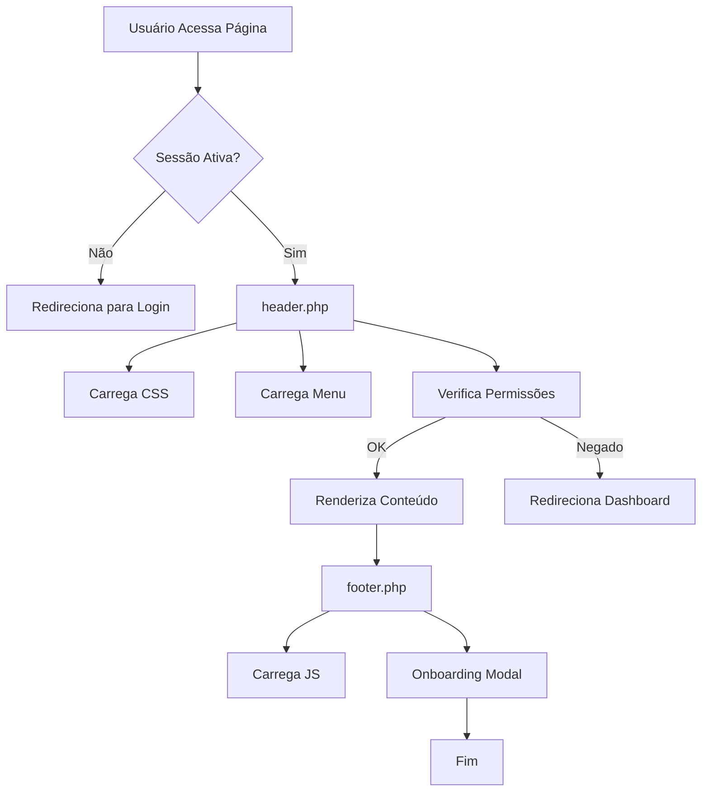

# Documentação Técnica - Includes & CSS

**Sistema**: Consulte+  
**Versão**: 2.4.2  
**Última Atualização**: Janeiro 2026

---

## 1. Visão Geral

### 1.1. Propósito
Esta documentação detalha a estrutura de **includes PHP** (componentes reutilizáveis) e **arquivos CSS** (estilos) do sistema Consulte+, explicando a arquitetura de layout, autenticação, menu e estilos visuais.

### 1.2. Estrutura de Diretórios

```
consulteplus/
├── includes/               # Componentes PHP reutilizáveis
│   ├── header.php         # Cabeçalho HTML + Meta Tags + CSS
│   ├── footer.php         # Rodapé HTML + Scripts JS
│   ├── menu.php           # Sidebar Navigation
│   ├── auth.php           # Funções de autenticação
│   ├── notificacoes-helper.php
│   ├── onboarding_modal.php
│   └── services/          # Serviços auxiliares
│
└── assets/
    ├── css/               # Folhas de estilo
    │   ├── style.css                    # Estilos base
    │   ├── custom.css                   # Customizações UX
    │   ├── custom-modern-sidebar.css    # Sidebar moderna
    │   ├── custom-override.css          # Sobrescritas
    │   ├── custom-sidebar.css           # Sidebar legacy
    │   └── tour.css                     # Tour guiado
    │
    ├── js/                # Scripts JavaScript
    │   ├── script.js
    │   ├── form-loading.js
    │   ├── sidebar-toggle.js
    │   ├── tour.js
    │   └── tours-config.js
    │
    └── img/               # Imagens e logos
```

---

## 2. Includes PHP

### 2.1. `header.php` - Cabeçalho do Sistema

**Localização**: `includes/header.php`

#### Responsabilidades
1. **Inicialização de Sessão** com configurações de segurança
2. **Carregamento de Dependências** (database, config, auth)
3. **Verificação de Autenticação** (`checkAuth()`)
4. **Estrutura HTML** (DOCTYPE, meta tags, CSS)
5. **Sidebar** e **Navbar Superior**
6. **Sistema de Alertas** (success, error, warning)

---

#### Estrutura do Código

```php
<?php
// 1. Output Buffering
ob_start();

// 2. Configurações de Sessão (Segurança)
if (session_status() === PHP_SESSION_NONE) {
    ini_set('session.cookie_httponly', 1);  // Previne XSS
    ini_set('session.use_only_cookies', 1); // Força cookies
    ini_set('session.cookie_secure', 0);    // HTTPS (mudar para 1 em produção)
    session_start();
}

// 3. Dependências
require_once __DIR__ . '/../config/database.php';
require_once __DIR__ . '/../config/config.php';
require_once __DIR__ . '/auth.php';

// 4. Verificar Autenticação
checkAuth();

// 5. Variáveis de Página
$pageTitle = isset($pageTitle) ? $pageTitle : SITE_NAME;
$currentPage = basename($_SERVER['PHP_SELF'], '.php');
?>
```

---

#### Meta Tags e CSS Carregados

```html
<head>
    <meta charset="UTF-8">
    <meta name="viewport" content="width=device-width, initial-scale=1.0">
    <title><?php echo $pageTitle; ?></title>

    <!-- Bootstrap 5 CSS -->
    <link href="https://cdn.jsdelivr.net/npm/bootstrap@5.3.0/dist/css/bootstrap.min.css" rel="stylesheet">

    <!-- Bootstrap Icons -->
    <link rel="stylesheet" href="https://cdn.jsdelivr.net/npm/bootstrap-icons@1.11.0/font/bootstrap-icons.css">

    <!-- DataTables CSS -->
    <link rel="stylesheet" href="https://cdn.datatables.net/1.13.7/css/dataTables.bootstrap5.min.css">

    <!-- Custom CSS (Ordem Importa!) -->
    <link rel="stylesheet" href="<?php echo BASE_URL; ?>assets/css/style.css?v=2.4.1">
    <link rel="stylesheet" href="<?php echo BASE_URL; ?>assets/css/custom.css?v=2.4.1">
    <link rel="stylesheet" href="<?php echo BASE_URL; ?>assets/css/custom-override.css?v=2.4.1">
    <link rel="stylesheet" href="<?php echo BASE_URL; ?>assets/css/custom-modern-sidebar.css?v=2.4.2">
    <link rel="stylesheet" href="<?php echo BASE_URL; ?>assets/css/tour.css?v=2.4.1">
</head>
```

**⚠️ Ordem de Carregamento CSS**:
1. **style.css** - Base styles
2. **custom.css** - UX improvements
3. **custom-override.css** - Sobrescritas específicas
4. **custom-modern-sidebar.css** - Sidebar moderna (última para ter prioridade)
5. **tour.css** - Estilos do tour guiado

---

#### Layout Structure

```html
<body>
    <div class="container-fluid">
        <div class="row">
            <!-- Sidebar -->
            <nav class="col-md-3 col-lg-2 d-md-block sidebar collapse">
                <div class="position-sticky pt-3">
                    <?php include __DIR__ . '/menu.php'; ?>
                </div>
            </nav>

            <!-- Main Content -->
            <main class="col-md-9 ms-sm-auto col-lg-10 px-md-4" style="min-width: 0;">
                <!-- Top Navbar -->
                <div class="navbar-top mb-3">
                    <div class="d-flex justify-content-between align-items-center">
                        <!-- Mobile Menu Toggle -->
                        <button class="btn btn-link d-md-none" type="button" 
                                data-bs-toggle="collapse" data-bs-target=".sidebar">
                            <i class="bi bi-list fs-3"></i>
                        </button>

                        <!-- User Info -->
                        <div class="ms-auto user-dropdown">
                            <i class="bi bi-person-circle"></i>
                            <strong><?php echo $_SESSION['nome']; ?></strong>
                            <small class="text-muted">(<?php echo ucfirst($_SESSION['tipo']); ?>)</small>
                        </div>
                    </div>
                </div>

                <!-- Sistema de Alertas -->
                <?php if (isset($_SESSION['success'])): ?>
                    <div class="alert alert-success alert-dismissible fade show" role="alert">
                        <i class="bi bi-check-circle me-2"></i>
                        <?php echo $_SESSION['success']; unset($_SESSION['success']); ?>
                        <button type="button" class="btn-close" data-bs-dismiss="alert"></button>
                    </div>
                <?php endif; ?>

                <!-- Conteúdo da Página Começa Aqui -->
```

---

### 2.2. `footer.php` - Rodapé do Sistema

**Localização**: `includes/footer.php`

#### Responsabilidades
1. **Fechar tags HTML** (`</main>`, `</div>`, `</body>`)
2. **Carregar Scripts JavaScript** (jQuery, Bootstrap, DataTables)
3. **Scripts Customizados** (form-loading, sidebar-toggle)
4. **Modal de Onboarding** (apenas para clientes)
5. **Flush do Output Buffer** (`ob_end_flush()`)

---

#### Scripts Carregados

```html
<!-- jQuery -->
<script src="https://code.jquery.com/jquery-3.7.1.min.js"></script>

<!-- Bootstrap 5 JS -->
<script src="https://cdn.jsdelivr.net/npm/bootstrap@5.3.0/dist/js/bootstrap.bundle.min.js"></script>

<!-- DataTables JS -->
<script src="https://cdn.datatables.net/1.13.7/js/jquery.dataTables.min.js"></script>
<script src="https://cdn.datatables.net/1.13.7/js/dataTables.bootstrap5.min.js"></script>

<!-- Custom JS -->
<script src="<?php echo BASE_URL; ?>assets/js/script.js?v=2.3.0"></script>
<script src="<?php echo BASE_URL; ?>assets/js/form-loading.js?v=2.3.0"></script>
<script src="<?php echo BASE_URL; ?>assets/js/sidebar-toggle.js?v=2.5.0"></script>

<!-- Onboarding Modal (Apenas Clientes) -->
<?php if (isset($_SESSION['tipo']) && $_SESSION['tipo'] === 'cliente') {
    include_once __DIR__ . '/onboarding_modal.php';
} ?>

</body>
</html>
<?php ob_end_flush(); ?>
```

**💡 Versionamento**: Parâmetro `?v=X.X.X` força cache-busting em atualizações.

---

### 2.3. `menu.php` - Sidebar Navigation

**Localização**: `includes/menu.php`

#### Responsabilidades
1. **Logo do Sistema** (Consulte+)
2. **Botão de Toggle** (recolher/expandir sidebar)
3. **Menu Dinâmico** baseado em permissões (`$_SESSION['tipo']`)
4. **Inclusão de Menu Administrativo** (`modules/admin/menu_items.php`)
5. **Perfil do Usuário** (footer da sidebar)

---

#### Estrutura do Menu

```php
<!-- Logo -->
<div class="mb-4 px-3 text-center">
    assets/img/logo-consulte-plus.png" 
         alt="Consulte+" 
         style="max-height: 45px; max-width: 180px;">
</div>

<hr class="my-3 mx-3">

<!-- Toggle Button -->
<button id="sidebarToggle" class="btn p-0 d-none d-md-block" 
        style="position: absolute; right: -22px; top: 20px; z-index: 10000;">
    <i class="bi bi-chevron-left fs-4" id="sidebarToggleIcon"></i>
</button>

<!-- Menu Items -->
<ul class="nav flex-column">
    <?php if ($_SESSION['tipo'] !== 'superadmin'): ?>
        
        <!-- Dashboard -->
        <li class="nav-item">
            <a class="nav-link <?php echo strpos($_SERVER['REQUEST_URI'], '/dashboard') !== false ? 'active' : ''; ?>" 
               href="<?php echo BASE_URL; ?>dashboard">
                <i class="bi bi-speedometer2"></i> <span>Dashboard</span>
            </a>
        </li>

        <!-- Diagnóstico -->
        <?php if (hasPermission(['admin', 'cliente'])): ?>
            <li class="nav-item">
                <a class="nav-link <?php echo strpos($_SERVER['REQUEST_URI'], '/gestao/diagnostico') !== false ? 'active' : ''; ?>" 
                   href="<?php echo BASE_URL; ?>gestao/diagnostico">
                    <i class="bi bi-ui-checks"></i> <span>Diagnóstico</span>
                </a>
            </li>
        <?php endif; ?>

        <!-- Produtos (Clientes) -->
        <?php if (hasPermission(['cliente'])): ?>
            <li class="nav-item">
                <a class="nav-link" href="<?php echo BASE_URL; ?>produtos">
                    <i class="bi bi-box-seam"></i> <span>Produtos</span>
                </a>
            </li>
        <?php endif; ?>

        <!-- Gestão Diária -->
        <?php if (hasPermission(['admin', 'cliente'])): ?>
            <li class="nav-item">
                <a class="nav-link" href="<?php echo BASE_URL; ?>gestao/projetos">
                    <i class="bi bi-diagram-3"></i> <span>Projetos</span>
                </a>
            </li>
            <li class="nav-item">
                <a class="nav-link" href="<?php echo BASE_URL; ?>gestao/tarefas">
                    <i class="bi bi-kanban"></i> <span>Tarefas</span>
                </a>
            </li>
            <li class="nav-item">
                <a class="nav-link" href="<?php echo BASE_URL; ?>gestao/planejamento">
                    <i class="bi bi-bullseye"></i> <span>OKRs</span>
                </a>
            </li>
        <?php endif; ?>

    <?php endif; ?>

    <!-- Menu Administrativo (Externalizado) -->
    <?php
    $adminMenuPath = __DIR__ . '/../modules/admin/menu_items.php';
    if (file_exists($adminMenuPath)) {
        include $adminMenuPath;
    }
    ?>

    <!-- Separador -->
    <hr class="my-2 border-secondary opacity-25 mt-auto">

    <!-- Usuário / Logout -->
    <li class="nav-item mt-3">
        <div class="bg-white rounded px-3 py-2 d-flex justify-content-between align-items-center">
            <div class="text-dark d-flex align-items-center">
                <i class="bi bi-person-circle me-2 fs-5"></i>
                <span class="fw-bold">
                    <?php
                    $primeiroNome = explode(' ', $_SESSION['nome'] ?? 'Usuário')[0];
                    echo htmlspecialchars($primeiroNome);
                    ?>
                </span>
            </div>
            <div class="d-flex align-items-center gap-3 ms-auto">
                <!-- Perfil -->
                <a href="<?php echo BASE_URL; ?>modules/perfil" 
                   class="text-secondary text-decoration-none" title="Meu Perfil">
                    <i class="bi bi-gear fs-5"></i>
                </a>
                <div class="vr bg-secondary opacity-25"></div>
                <!-- Logout -->
                <a href="<?php echo BASE_URL; ?>logout.php" 
                   class="text-danger text-decoration-none" title="Sair">
                    <i class="bi bi-box-arrow-right fs-5"></i>
                </a>
            </div>
        </div>
    </li>
</ul>
```

---

#### Lógica de Permissões

**Função `hasPermission()`** (definida em `auth.php`):

```php
function hasPermission($allowedTypes = []) {
    checkAuth();
    
    // Superadmin bypass
    if ($_SESSION['tipo'] === 'superadmin') {
        return true;
    }
    
    if (!empty($allowedTypes) && !in_array($_SESSION['tipo'], $allowedTypes)) {
        return false;
    }
    
    return true;
}
```

**Tipos de Usuário**:
- `superadmin` - Acesso total
- `admin` - Área administrativa
- `cliente` - Área do cliente

---

### 2.4. `auth.php` - Autenticação e Permissões

**Localização**: `includes/auth.php`

#### Funções Principais

| Função | Descrição |
|:---|:---|
| `checkAuth()` | Verifica se usuário está logado, redireciona para login se não |
| `checkModuleBoundary()` | Impede cliente de acessar `/modules/admin/` e vice-versa |
| `checkPermission($allowedTypes)` | Valida permissões por tipo de usuário |
| `login($email, $password)` | Autentica usuário e cria sessão |
| `logout()` | Destroi sessão e redireciona |
| `getCurrentUser()` | Retorna dados do usuário logado |
| `getCompanyId()` | Retorna ID da empresa (multi-tenancy) |

---

#### Configurações de Segurança

```php
// Configurações de Sessão
ini_set('session.cookie_httponly', 1);  // Previne acesso via JavaScript (XSS)
ini_set('session.use_only_cookies', 1); // Força uso de cookies
ini_set('session.cookie_secure', 0);    // Mudar para 1 em HTTPS
```

**⚠️ Produção**: Alterar `session.cookie_secure` para `1` em ambiente HTTPS.

---

#### Fronteiras de Módulos

```php
function checkModuleBoundary() {
    if (!isset($_SESSION['tipo'])) return;
    
    $uri = str_replace('\\', '/', $_SERVER['REQUEST_URI']);
    $role = $_SESSION['tipo'];
    $isAdmin = in_array($role, ['admin', 'superadmin']);
    
    // 1. Bloquear Cliente na área Admin
    if (strpos($uri, '/modules/admin/') !== false) {
        if (!$isAdmin) {
            $_SESSION['error'] = 'Acesso não autorizado à área administrativa.';
            redirect('dashboard');
        }
    }
    
    // 2. Bloquear Admin na área Cliente
    if (strpos($uri, '/modules/') !== false && strpos($uri, '/modules/admin/') === false) {
        if ($isAdmin) {
            $_SESSION['warning'] = 'Administradores devem usar a área administrativa.';
            redirect('admin/dashboard');
        }
    }
}
```

---

#### Multi-Tenancy

```php
function login($email, $password) {
    global $conn;
    
    $stmt = $conn->prepare("SELECT id, nome, email, senha, tipo, company_id FROM users WHERE email = ? AND ativo = 1");
    $stmt->bind_param("s", $email);
    $stmt->execute();
    $result = $stmt->get_result();
    
    if ($result->num_rows === 1) {
        $user = $result->fetch_assoc();
        
        if (verifyPassword($password, $user['senha'])) {
            $_SESSION['user_id'] = $user['id'];
            $_SESSION['nome'] = $user['nome'];
            $_SESSION['email'] = $user['email'];
            $_SESSION['tipo'] = $user['tipo'];
            $_SESSION['company_id'] = $user['company_id']; // ✅ Multi-tenancy
            return true;
        }
    }
    
    return false;
}

function getCompanyId() {
    return $_SESSION['company_id'] ?? 1; // Fallback para empresa padrão
}
```

---

## 3. Arquivos CSS

### 3.1. `style.css` - Estilos Base

**Localização**: `assets/css/style.css`  
**Linhas**: 390  
**Versão**: 2.4.1

#### Variáveis CSS (`:root`)

```css
:root {
    --primary-color: #0d6efd;      /* Azul Bootstrap */
    --primary-dark: #0a58ca;
    --secondary-color: #6c757d;    /* Cinza */
    --success-color: #198754;      /* Verde */
    --danger-color: #dc3545;       /* Vermelho */
    --warning-color: #ffc107;      /* Amarelo */
    --info-color: #0dcaf0;         /* Ciano */
    --light-color: #f8f9fa;
    --dark-color: #212529;
}
```

---

#### Componentes Estilizados

##### **Sidebar**

```css
.sidebar {
    min-height: 100vh;
    background-color: var(--primary-color);
    box-shadow: 2px 0 10px rgba(0, 0, 0, 0.1);
}

.sidebar .nav-link {
    color: rgba(255, 255, 255, 0.8);
    padding: 12px 20px;
    margin: 5px 10px;
    border-radius: 8px;
    transition: all 0.3s ease;
}

.sidebar .nav-link:hover {
    background-color: rgba(255, 255, 255, 0.1);
    color: white;
    transform: translateX(5px);
}

.sidebar .nav-link.active {
    background-color: rgba(255, 255, 255, 0.2);
    color: white;
    font-weight: 600;
}
```

---

##### **Cards**

```css
.card {
    border: none;
    border-radius: 12px;
    box-shadow: 0 2px 8px rgba(0, 0, 0, 0.08);
    transition: all 0.3s ease;
}

.card:hover {
    box-shadow: 0 4px 16px rgba(0, 0, 0, 0.12);
}

.card-header {
    background-color: white;
    border-bottom: 2px solid #f0f0f0;
    font-weight: 600;
    padding: 15px 20px;
}
```

---

##### **Botões**

```css
.btn {
    border-radius: 8px;
    padding: 8px 20px;
    font-weight: 500;
    transition: all 0.3s ease;
}

.btn:hover {
    box-shadow: 0 4px 12px rgba(0, 0, 0, 0.15);
}
```

---

##### **Formulários**

```css
.form-control,
.form-select {
    border-radius: 8px;
    border: 1px solid #dee2e6;
    padding: 10px 15px;
    transition: all 0.3s ease;
}

.form-control:focus,
.form-select:focus {
    border-color: var(--primary-color);
    box-shadow: 0 0 0 0.2rem rgba(13, 110, 253, 0.15);
}

.form-label {
    font-weight: 500;
    color: #495057;
    margin-bottom: 8px;
}
```

---

##### **Tabelas**

```css
.table thead th {
    border-bottom: 2px solid #dee2e6;
    font-weight: 600;
    text-transform: uppercase;
    font-size: 0.85rem;
    color: #6c757d;
}

.table tbody tr {
    transition: all 0.2s ease;
}

.table tbody tr:hover {
    background-color: #f8f9fa;
}
```

---

##### **Relógio em Tempo Real**

```css
.live-clock {
    text-align: right;
    padding: 8px 16px;
    background: var(--primary-color);
    border-radius: 10px;
    box-shadow: 0 4px 15px rgba(13, 110, 253, 0.3);
}

.clock-time {
    font-size: 1.75rem;
    font-weight: 700;
    color: white;
    font-family: 'Courier New', monospace;
    letter-spacing: 2px;
}

.clock-date {
    font-size: 0.75rem;
    color: rgba(255, 255, 255, 0.9);
    font-weight: 500;
}
```

---

##### **Animações**

```css
@keyframes fadeIn {
    from {
        opacity: 0;
        transform: translateY(20px);
    }
    to {
        opacity: 1;
        transform: translateY(0);
    }
}

.fade-in {
    animation: fadeIn 0.5s ease;
}
```

---

### 3.2. `custom.css` - Melhorias de UX

**Localização**: `assets/css/custom.css`  
**Linhas**: 188  
**Versão**: 2.4.1

#### Destaques

##### **Loading State para Botões**

```css
.btn.loading {
    position: relative;
    color: transparent;
}

.btn.loading::after {
    content: "";
    position: absolute;
    width: 16px;
    height: 16px;
    top: 50%;
    left: 50%;
    margin-left: -8px;
    margin-top: -8px;
    border: 2px solid #ffffff;
    border-radius: 50%;
    border-top-color: transparent;
    animation: spin 0.6s linear infinite;
}

@keyframes spin {
    to { transform: rotate(360deg); }
}
```

**Uso**:
```javascript
$('#btnSalvar').addClass('loading');
// Após requisição AJAX
$('#btnSalvar').removeClass('loading');
```

---

##### **Status Dots**

```css
.status-dot {
    display: inline-block;
    width: 8px;
    height: 8px;
    border-radius: 50%;
    margin-right: 6px;
}

.status-dot.success { background-color: #198754; }
.status-dot.warning { background-color: #ffc107; }
.status-dot.danger { background-color: #dc3545; }
.status-dot.info { background-color: #0dcaf0; }
```

**Uso**:
```html
<span class="status-dot success"></span> Ativo
<span class="status-dot danger"></span> Inativo
```

---

##### **Empty State**

```css
.empty-state {
    text-align: center;
    padding: 3rem 1rem;
    color: #6c757d;
}

.empty-state i {
    font-size: 3rem;
    margin-bottom: 1rem;
    opacity: 0.5;
}
```

**Uso**:
```html
<div class="empty-state">
    <i class="bi bi-inbox"></i>
    <p>Nenhum registro encontrado</p>
</div>
```

---

### 3.3. `custom-modern-sidebar.css` - Sidebar Moderna

**Localização**: `assets/css/custom-modern-sidebar.css`  
**Linhas**: 290  
**Versão**: 2.4.2

#### Características

✅ **Sidebar Branca** (ao invés de azul)  
✅ **Modo Mini** (80px de largura)  
✅ **Toggle Animado**  
✅ **Indicador Visual** (linha azul no item ativo)  
✅ **Responsivo** (mobile-friendly)

---

#### Estrutura de Estados

```css
/* Estado Normal (240px) */
body:not(.sidebar-mini) .sidebar {
    width: 240px !important;
    position: fixed !important;
    background-color: #ffffff !important;
    border-right: 1px solid rgba(0, 0, 0, 0.05);
    box-shadow: 4px 0 24px rgba(0, 0, 0, 0.02);
}

/* Estado Mini (80px) */
body.sidebar-mini .sidebar {
    width: 80px !important;
    overflow: visible !important; /* Permite tooltips */
}

/* Ajuste do Main Content */
body:not(.sidebar-mini) main {
    margin-left: 240px !important;
    width: calc(100% - 240px) !important;
}

body.sidebar-mini main {
    margin-left: 80px !important;
    width: calc(100% - 80px) !important;
}
```

---

#### Links de Navegação

```css
.sidebar .nav-link {
    color: #64748b !important;        /* Azul acinzentado */
    font-weight: 500;
    margin: 4px 16px;
    border-radius: 8px;
    padding: 10px 16px;
    transition: all 0.2s ease;
}

.sidebar .nav-link i {
    color: #94a3b8;                   /* Ícone inativo */
    margin-right: 12px;
    font-size: 1.1rem;
}

/* Hover */
.sidebar .nav-link:hover {
    background-color: #f8fafc;
    color: #0f172a !important;
}

.sidebar .nav-link:hover i {
    color: #1D2F5F;                   /* Azul no hover */
}

/* Active */
.sidebar .nav-link.active {
    background-color: #f1f5f9 !important;
    color: #1D2F5F !important;
    font-weight: 700;
}

.sidebar .nav-link.active i {
    color: #1D2F5F !important;
}

/* Linha Indicadora (Active) */
.sidebar .nav-link.active::before {
    content: '';
    position: absolute;
    left: -16px;
    top: 50%;
    transform: translateY(-50%);
    height: 24px;
    width: 4px;
    background-color: #1D2F5F;
    border-top-right-radius: 4px;
    border-bottom-right-radius: 4px;
}
```

---

#### Modo Mini

```css
/* Centralizar ícones */
body.sidebar-mini .sidebar .nav-link {
    margin: 4px auto !important;
    justify-content: center !important;
    padding: 12px 0 !important;
    width: 48px !important;
    height: 48px !important;
}

body.sidebar-mini .sidebar .nav-link i {
    margin-right: 0 !important;
    font-size: 1.4rem;
}

/* Esconder texto */
body.sidebar-mini .sidebar .nav-link span {
    display: none !important;
}

/* Esconder logo */
body.sidebar-mini .sidebar .mb-4.px-3 {
    display: none !important;
}
```

---

#### Toggle Button

```css
#sidebarToggle {
    color: #64748b !important;
    background: #ffffff !important;
    border: 1px solid #e2e8f0;
    border-radius: 50%;
    width: 36px;
    height: 36px;
    padding: 0 !important;
    display: flex !important;
    align-items: center;
    justify-content: center;
    box-shadow: 0 2px 8px rgba(0, 0, 0, 0.1);
}

#sidebarToggle:hover {
    background-color: #f1f5f9 !important;
    color: #0f172a !important;
    box-shadow: 0 4px 12px rgba(0, 0, 0, 0.15);
}
```

---

### 3.4. `tour.css` - Tour Guiado

**Localização**: `assets/css/tour.css`  
**Linhas**: 3192  
**Versão**: 2.4.1

#### Propósito
Estilos para o sistema de **tour guiado** (onboarding interativo) usando a biblioteca **Shepherd.js**.

#### Componentes

```css
/* Tour Container */
.shepherd-element {
    background: white;
    border-radius: 12px;
    box-shadow: 0 8px 32px rgba(0, 0, 0, 0.2);
    max-width: 400px;
}

/* Tour Header */
.shepherd-header {
    padding: 1rem;
    border-bottom: 1px solid #e9ecef;
}

/* Tour Content */
.shepherd-text {
    padding: 1rem;
    font-size: 0.95rem;
    line-height: 1.6;
}

/* Tour Buttons */
.shepherd-button {
    background: #0d6efd;
    color: white;
    border: none;
    padding: 0.5rem 1rem;
    border-radius: 6px;
    cursor: pointer;
    transition: all 0.3s ease;
}

.shepherd-button:hover {
    background: #0a58ca;
    transform: translateY(-2px);
}

/* Tour Arrow */
.shepherd-arrow {
    border-color: white;
}
```

---

## 4. Uso Prático

### 4.1. Criar Nova Página

```php
<?php
$pageTitle = "Minha Página - Consulte+";
require_once __DIR__ . '/includes/header.php';
?>

<!-- Conteúdo da Página -->
<div class="container-fluid">
    <div class="page-header">
        <h1><i class="bi bi-star"></i> Minha Página</h1>
    </div>

    <div class="card">
        <div class="card-header">
            <h5 class="mb-0">Título do Card</h5>
        </div>
        <div class="card-body">
            <p>Conteúdo aqui...</p>
        </div>
    </div>
</div>

<?php require_once __DIR__ . '/includes/footer.php'; ?>
```

---

### 4.2. Adicionar Item ao Menu

**Editar**: `includes/menu.php`

```php
<!-- Novo Item -->
<li class="nav-item">
    <a class="nav-link <?php echo strpos($_SERVER['REQUEST_URI'], '/meu-modulo') !== false ? 'active' : ''; ?>" 
       href="<?php echo BASE_URL; ?>meu-modulo">
        <i class="bi bi-star"></i> <span>Meu Módulo</span>
    </a>
</li>
```

---

### 4.3. Aplicar Permissões

```php
<?php
// Apenas Admin e Superadmin
checkPermission(['admin', 'superadmin']);
?>

<!-- OU -->

<?php if (hasPermission(['admin', 'cliente'])): ?>
    <button class="btn btn-primary">Ação Permitida</button>
<?php endif; ?>
```

---

### 4.4. Adicionar Alerta

```php
<?php
$_SESSION['success'] = 'Operação realizada com sucesso!';
$_SESSION['error'] = 'Erro ao processar solicitação.';
$_SESSION['warning'] = 'Atenção: verifique os dados.';

redirect('dashboard');
?>
```

---

### 4.5. Customizar CSS

**Criar**: `assets/css/meu-modulo.css`

```css
/* Meus Estilos */
.minha-classe {
    background-color: #f8f9fa;
    padding: 20px;
    border-radius: 10px;
}
```

**Incluir no `header.php`**:

```html
<link rel="stylesheet" href="<?php echo BASE_URL; ?>assets/css/meu-modulo.css?v=1.0.0">
```

---

## 5. Boas Práticas

### 5.1. Versionamento de Assets

✅ **Sempre usar** `?v=X.X.X` para forçar atualização de cache:

```html
<link rel="stylesheet" href="assets/css/style.css?v=2.4.1">
<script src="assets/js/script.js?v=2.3.0"></script>
```

---

### 5.2. Ordem de Carregamento CSS

```
1. style.css           (Base)
2. custom.css          (UX)
3. custom-override.css (Sobrescritas)
4. custom-modern-sidebar.css (Sidebar - última!)
5. tour.css            (Tour guiado)
```

**⚠️ Importante**: Sidebar CSS deve ser carregado **por último** para ter prioridade.

---

### 5.3. Segurança

✅ **Sempre escapar output**:
```php
echo htmlspecialchars($_SESSION['nome']);
```

✅ **Validar permissões**:
```php
checkAuth();
checkPermission(['admin']);
```

✅ **HTTPS em Produção**:
```php
ini_set('session.cookie_secure', 1);
```

---

### 5.4. Performance

✅ **Minificar CSS/JS** em produção  
✅ **Usar CDN** para bibliotecas (Bootstrap, jQuery)  
✅ **Lazy load** de imagens pesadas  
✅ **Cache busting** com versionamento

---

## 6. Troubleshooting

### 6.1. Sidebar não aparece

**Causa**: CSS não carregado ou ordem incorreta.

**Solução**:
```html
<!-- Verificar ordem -->
<link rel="stylesheet" href="assets/css/custom-modern-sidebar.css?v=2.4.2">
```

---

### 6.2. Alertas não aparecem

**Causa**: `$_SESSION` não iniciada ou `header.php` não incluído.

**Solução**:
```php
// Sempre incluir header.php
require_once __DIR__ . '/includes/header.php';
```

---

### 6.3. Menu não marca item ativo

**Causa**: Lógica de `strpos()` incorreta.

**Solução**:
```php
<?php echo strpos($_SERVER['REQUEST_URI'], '/dashboard') !== false ? 'active' : ''; ?>
```

---

### 6.4. Permissões não funcionam

**Causa**: `auth.php` não incluído ou sessão não iniciada.

**Solução**:
```php
require_once __DIR__ . '/includes/auth.php';
checkAuth();
```

---

## 7. Diagrama de Fluxo



---

## 8. Checklist de Implementação

### Nova Página
- [ ] Definir `$pageTitle`
- [ ] Incluir `header.php`
- [ ] Verificar permissões (`checkPermission()`)
- [ ] Adicionar conteúdo
- [ ] Incluir `footer.php`
- [ ] Adicionar item ao menu (se necessário)
- [ ] Testar responsividade

### Novo CSS
- [ ] Criar arquivo em `assets/css/`
- [ ] Versionar (`?v=1.0.0`)
- [ ] Incluir no `header.php` na ordem correta
- [ ] Testar em diferentes navegadores
- [ ] Minificar para produção

### Nova Funcionalidade
- [ ] Verificar autenticação
- [ ] Validar permissões
- [ ] Implementar lógica
- [ ] Adicionar alertas de feedback
- [ ] Documentar no DOCS.md

---

*Documento vivo. Última revisão: 24/01/2026*
