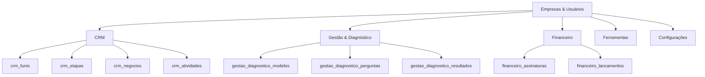
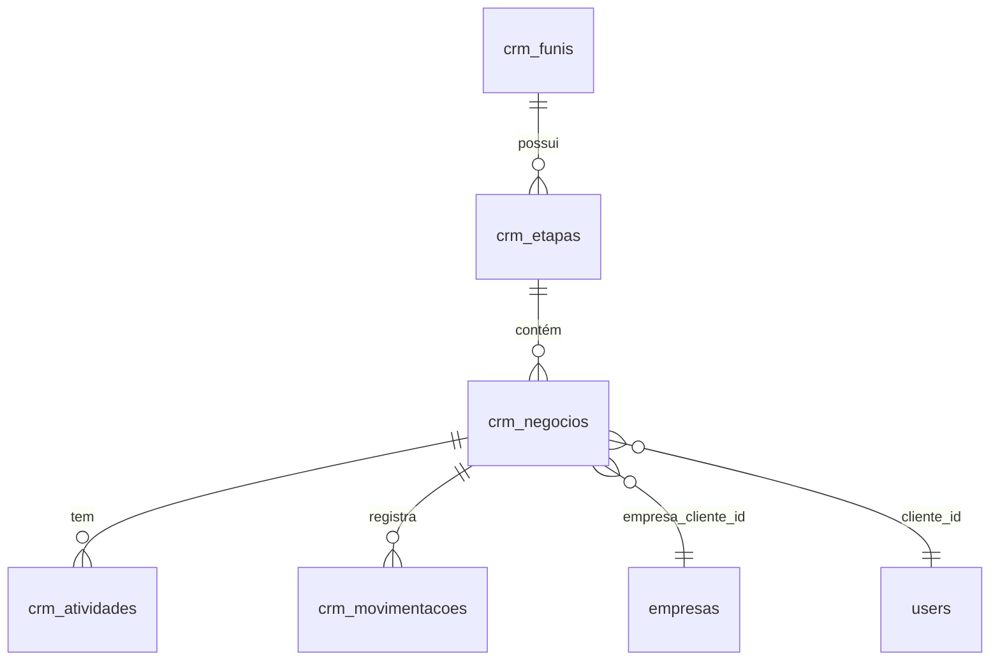
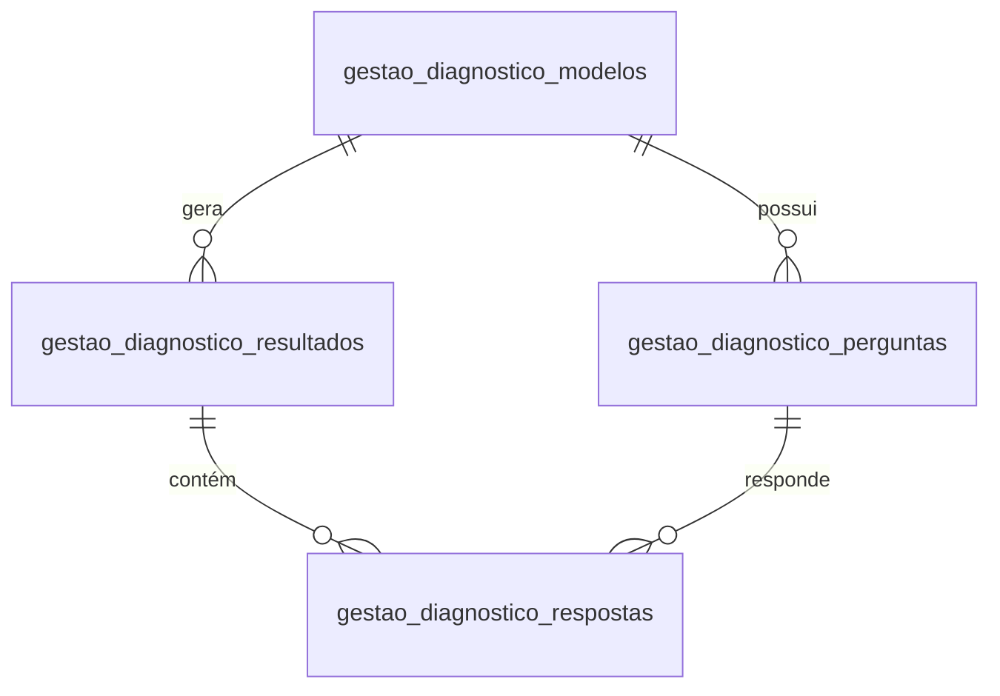
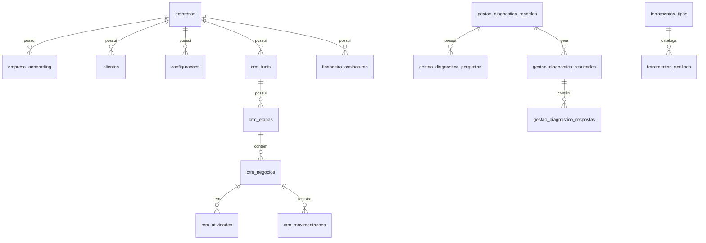

# Documentação Técnica - Banco de Dados

**Sistema**: Consulte+  
**SGBD**: MariaDB 10.4.32  
**Charset**: utf8mb4 / utf8mb4_unicode_ci  
**Última Atualização**: Janeiro 2026

---

## 1. Visão Geral

### 1.1. Propósito
O banco de dados do Consulte+ foi projetado para suportar um sistema **multi-tenant** de gestão empresarial com foco em:
- CRM (Customer Relationship Management)
- Gestão de diagnósticos empresariais
- Ferramentas de análise estratégica
- Gestão financeira e assinaturas
- Sistema de onboarding

### 1.2. Características Principais
- **Multi-Tenancy**: Isolamento de dados por `company_id`
- **Auditoria**: Campos `created_at` e `updated_at` em todas as tabelas
- **Soft Delete**: Flag `ativo` para desativação lógica
- **Integridade Referencial**: Foreign Keys com ações ON DELETE
- **Indexação**: Índices estratégicos para performance

---

## 2. Arquitetura do Banco

### 2.1. Grupos de Tabelas



### 2.2. Tabelas por Módulo

| Módulo | Tabelas | Propósito |
|:---|:---|:---|
| **Core** | `empresas`, `empresa_onboarding`, `clientes`, `configuracoes` | Gestão de empresas e clientes |
| **CRM** | `crm_funis`, `crm_etapas`, `crm_negocios`, `crm_atividades`, `crm_movimentacoes` | Pipeline de vendas |
| **Diagnóstico** | `gestao_diagnostico_modelos`, `gestao_diagnostico_perguntas`, `gestao_diagnostico_respostas`, `gestao_diagnostico_resultados` | Avaliação de maturidade |
| **Ferramentas** | `ferramentas_tipos`, `ferramentas_analises` | SWOT, Porter, BSC, etc. |
| **Financeiro** | `financeiro_assinaturas`, `financeiro_lancamentos` | Recorrência e pagamentos |

---

## 3. Tabelas Principais

### 3.1. Core - Empresas

#### `empresas`
**Propósito**: Cadastro de empresas clientes (multi-tenancy)

| Coluna | Tipo | Descrição |
|:---|:---|:---|
| `id` | INT PK | Identificador único |
| `nome` | VARCHAR(255) | Razão social |
| `documento` | VARCHAR(20) | CNPJ ou CPF |
| `asaas_customer_id` | VARCHAR(50) | ID no gateway Asaas |
| `ativo` | TINYINT(1) | Status ativo/inativo |
| `onboarding_done` | TINYINT(1) | Se completou onboarding |
| `created_at` | DATETIME | Data de criação |

**Relacionamentos**:
- 1:1 com `empresa_onboarding`
- 1:N com `users` (via `company_id`)
- 1:N com `crm_negocios`
- 1:N com `financeiro_assinaturas`

**Índices**:
- PRIMARY KEY (`id`)

---

#### `empresa_onboarding`
**Propósito**: Dados coletados no processo de onboarding

| Coluna | Tipo | Descrição |
|:---|:---|:---|
| `id` | INT PK | Identificador único |
| `company_id` | INT FK | Vínculo com empresa |
| `tempo_existencia` | VARCHAR(50) | Ex: "1 a 5 anos" |
| `metodo_gestao_anterior` | VARCHAR(100) | Ex: "Planilhas Excel" |
| `tamanho_equipe` | VARCHAR(50) | Ex: "6-10" |
| `segmento` | TEXT (JSON) | Array de segmentos |
| `created_at` | DATETIME | Data de criação |

**Exemplo de `segmento`**:
```json
["Saúde / Clínica", "Consultoria"]
```

---

#### `clientes`
**Propósito**: Cadastro de clientes/pacientes das empresas

| Coluna | Tipo | Descrição |
|:---|:---|:---|
| `id` | INT PK | Identificador único |
| `company_id` | INT | Multi-tenancy |
| `nome` | VARCHAR(150) | Nome completo |
| `email` | VARCHAR(100) | Email de contato |
| `telefone` | VARCHAR(20) | Telefone |
| `cpf_cnpj` | VARCHAR(20) | Documento |
| `data_nascimento` | DATE | Data de nascimento |
| `endereco` | TEXT | Endereço completo |
| `observacoes` | TEXT | Notas adicionais |
| `ativo` | TINYINT(1) | Status |

**Índices**:
- PRIMARY KEY (`id`)
- Recomendado: INDEX (`company_id`, `ativo`)

---

### 3.2. CRM - Pipeline de Vendas

#### Diagrama de Relacionamento



---

#### `crm_funis`
**Propósito**: Funis de vendas (ex: Comercial, Pós-venda)

| Coluna | Tipo | Descrição |
|:---|:---|:---|
| `id` | INT PK | Identificador único |
| `company_id` | INT | Multi-tenancy |
| `nome` | VARCHAR(100) | Nome do funil |
| `descricao` | TEXT | Descrição |
| `padrao` | TINYINT(1) | Se é funil padrão |
| `ativo` | TINYINT(1) | Status |

**Exemplo**:
```sql
INSERT INTO crm_funis (company_id, nome, padrao, ativo) 
VALUES (1, 'Comercial', 1, 1);
```

---

#### `crm_etapas`
**Propósito**: Etapas dentro de cada funil

| Coluna | Tipo | Descrição |
|:---|:---|:---|
| `id` | INT PK | Identificador único |
| `company_id` | INT | Multi-tenancy |
| `funil_id` | INT FK | Vínculo com funil |
| `nome` | VARCHAR(100) | Ex: "Oportunidades novas" |
| `cor` | VARCHAR(20) | Hex color (ex: #6c757d) |
| `ordem` | INT | Ordem de exibição |
| `probabilidade_sucesso` | INT | 0 a 100 |

**Foreign Keys**:
- `funil_id` → `crm_funis(id)` ON DELETE CASCADE

---

#### `crm_negocios`
**Propósito**: Oportunidades de venda

| Coluna | Tipo | Descrição |
|:---|:---|:---|
| `id` | INT PK | Identificador único |
| `company_id` | INT | Multi-tenancy |
| `codigo` | CHAR(10) | Ex: "NEG-102" |
| `titulo` | VARCHAR(200) | Ex: "Tratamento de Varizes" |
| `valor_estimado` | DECIMAL(10,2) | Valor esperado |
| `funil_id` | INT FK | Funil atual |
| `etapa_id` | INT FK | Etapa atual |
| `responsavel_id` | INT FK | Vendedor (users) |
| `origem` | VARCHAR(50) | Ex: "Instagram", "Google" |
| `status` | ENUM | 'aberto', 'ganho', 'perdido', 'cancelado' |
| `motivo_perda` | VARCHAR(200) | Se perdido |
| `data_fechamento_esperada` | DATE | Previsão |
| `data_fechamento_real` | DATE | Data efetiva |
| `cliente_id` | INT FK | Contato (users) |
| `empresa_cliente_id` | INT FK | Empresa cliente (B2B) |

**Índices**:
- PRIMARY KEY (`id`)
- INDEX (`company_id`, `status`)
- INDEX (`etapa_id`)
- INDEX (`responsavel_id`)

---

#### `crm_atividades`
**Propósito**: Histórico de interações com negócios

| Coluna | Tipo | Descrição |
|:---|:---|:---|
| `id` | INT PK | Identificador único |
| `company_id` | INT | Multi-tenancy |
| `negocio_id` | INT FK | Vínculo com negócio |
| `tipo` | ENUM | 'nota', 'tarefa', 'ligacao', 'whatsapp', 'reuniao', 'email' |
| `descricao` | TEXT | Conteúdo da atividade |
| `data_vencimento` | DATETIME | Para tarefas |
| `concluido` | TINYINT(1) | Status de conclusão |
| `realizado_por` | INT FK | Usuário responsável |

**Foreign Keys**:
- `negocio_id` → `crm_negocios(id)` ON DELETE CASCADE

---

#### `crm_movimentacoes`
**Propósito**: Auditoria de mudanças de etapa

| Coluna | Tipo | Descrição |
|:---|:---|:---|
| `id` | INT PK | Identificador único |
| `company_id` | INT | Multi-tenancy |
| `negocio_id` | INT FK | Negócio movimentado |
| `etapa_anterior_id` | INT FK | Etapa de origem |
| `etapa_nova_id` | INT FK | Etapa de destino |
| `usuario_id` | INT FK | Quem moveu |
| `created_at` | DATETIME | Quando moveu |

**Uso**:
Permite rastrear o tempo médio em cada etapa e gerar relatórios de conversão.

---

### 3.3. Gestão - Diagnóstico Empresarial

#### Diagrama de Relacionamento



---

#### `gestao_diagnostico_modelos`
**Propósito**: Templates de diagnóstico (ex: Maturidade de Negócio, Diagnóstico Financeiro)

| Coluna | Tipo | Descrição |
|:---|:---|:---|
| `id` | INT PK | Identificador único |
| `titulo` | VARCHAR(255) | Nome do modelo |
| `descricao` | TEXT | Objetivo do diagnóstico |
| `ativo` | TINYINT(1) | Status |
| `created_at` | TIMESTAMP | Data de criação |
| `updated_at` | TIMESTAMP | Última atualização |

**⚠️ Observação**: Tabela **GLOBAL** (sem `company_id`). Modelos são compartilhados entre todas as empresas.

**Exemplo**:
```sql
INSERT INTO gestao_diagnostico_modelos (titulo, descricao, ativo) 
VALUES (
    'Maturidade de Negócio',
    'Modelo padrão geral para avaliação de maturidade de empresas.',
    1
);
```

---

#### `gestao_diagnostico_perguntas`
**Propósito**: Perguntas de cada modelo de diagnóstico

| Coluna | Tipo | Descrição |
|:---|:---|:---|
| `id` | INT PK | Identificador único |
| `modelo_id` | INT FK | Modelo ao qual pertence |
| `secao` | VARCHAR(50) | Ex: "Financeiro", "Operacional" |
| `texto_pergunta` | VARCHAR(255) | Pergunta exibida |
| `tipo` | VARCHAR(50) | 'escala', 'selecao', 'texto', 'numero', 'multipla' |
| `opcoes` | LONGTEXT (JSON) | Array de opções (se aplicável) |
| `logica_ia` | TEXT | Contexto para análise de IA |
| `texto_min` | VARCHAR(100) | Label para nota 0 (escala) |
| `texto_max` | VARCHAR(100) | Label para nota 100 (escala) |
| `ordem` | INT | Ordem de exibição |

**Exemplo de `opcoes` (tipo='selecao')**:
```json
["Sim, totalmente separadas", "Parcialmente separadas", "Não são separadas"]
```

**Exemplo de `opcoes` (tipo='multipla')**:
```json
["Telefone fixo", "WhatsApp da Recepção", "Agendamento Online"]
```

**Foreign Keys**:
- `modelo_id` → `gestao_diagnostico_modelos(id)`

---

#### `gestao_diagnostico_resultados`
**Propósito**: Resultado consolidado de um diagnóstico realizado

| Coluna | Tipo | Descrição |
|:---|:---|:---|
| `id` | INT PK | Identificador único (historico_id) |
| `user_id` | INT FK | Usuário que realizou |
| `company_id` | INT | Empresa avaliada |
| `modelo_id` | INT FK | Modelo utilizado |
| `data_realizacao` | DATETIME | Quando foi feito |
| `score_geral` | DECIMAL(5,2) | Nota geral (0-100) |
| `score_operacao` | DECIMAL(5,2) | Nota operacional |
| `score_financeiro` | DECIMAL(5,2) | Nota financeira |
| `score_aquisicao` | INT | Nota aquisição |
| `score_equipe` | INT | Nota equipe |
| `score_jornada` | INT | Nota jornada do cliente |
| `nivel_maturidade` | VARCHAR(50) | Ex: "Em Crescimento" |
| `analise_ia` | TEXT (HTML) | Análise gerada por IA |
| `sugestao_projetos` | LONGTEXT (JSON) | Projetos sugeridos |

**Exemplo de `sugestao_projetos`**:
```json
[
  {
    "titulo": "Automatização Financeira",
    "descricao": "Implementar sistemas integrados...",
    "prioridade": "alta",
    "okrs": [...],
    "tarefas": [...]
  }
]
```

---

#### `gestao_diagnostico_respostas`
**Propósito**: Respostas individuais de cada pergunta

| Coluna | Tipo | Descrição |
|:---|:---|:---|
| `id` | INT PK | Identificador único |
| `historico_id` | INT FK | Resultado ao qual pertence |
| `pergunta_id` | INT FK | Pergunta respondida |
| `valor_escolhido` | TEXT | Resposta (pode ser JSON para múltipla) |

**Exemplos de `valor_escolhido`**:
- Tipo escala: `"75"` (0-100)
- Tipo seleção: `"Sim, totalmente separadas"`
- Tipo múltipla: `"WhatsApp Pessoal do Médico, Agendamento Online"`
- Tipo texto: `"Principais despesas são infraestrutura e pessoal"`

**Foreign Keys**:
- `historico_id` → `gestao_diagnostico_resultados(id)`
- `pergunta_id` → `gestao_diagnostico_perguntas(id)`

---

### 3.4. Ferramentas Estratégicas

#### `ferramentas_tipos`
**Propósito**: Catálogo de ferramentas disponíveis (SWOT, Porter, BSC, etc.)

| Coluna | Tipo | Descrição |
|:---|:---|:---|
| `id` | INT PK | Identificador único |
| `slug` | VARCHAR(50) UNIQUE | Ex: "swot", "porter" |
| `nome` | VARCHAR(100) | Nome exibido |
| `descricao` | TEXT | Explicação da ferramenta |
| `icone` | VARCHAR(50) | Classe Bootstrap Icon |
| `ativo` | TINYINT(1) | Status |
| `ordem` | INT | Ordem de exibição |

**Ferramentas Disponíveis**:
1. **SWOT** - Análise de Forças, Fraquezas, Oportunidades e Ameaças
2. **Porter** - 5 Forças de Porter
3. **BSC** - Balanced Scorecard
4. **PESTEL** - Análise de macroambiente
5. **Mix** - Mix de Marketing (4 Ps)
6. **5W2H** - Plano de Ação
7. **BCG** - Matriz BCG
8. **Canvas** - Business Model Canvas

---

#### `ferramentas_analises`
**Propósito**: Análises criadas pelos usuários

| Coluna | Tipo | Descrição |
|:---|:---|:---|
| `id` | INT PK | Identificador único |
| `company_id` | INT | Multi-tenancy |
| `user_id` | INT FK | Criador |
| `ferramenta` | VARCHAR(50) | Slug da ferramenta |
| `titulo` | VARCHAR(255) | Nome da análise |
| `conteudo` | LONGTEXT (JSON) | Dados estruturados |
| `created_at` | DATETIME | Data de criação |
| `updated_at` | DATETIME | Última edição |

**Exemplo de `conteudo` (SWOT)**:
```json
{
  "forcas": ["Equipe qualificada", "Localização estratégica"],
  "fraquezas": ["Processos manuais", "Baixo marketing"],
  "oportunidades": ["Mercado em crescimento"],
  "ameacas": ["Concorrência forte"]
}
```

---

### 3.5. Financeiro

#### `financeiro_assinaturas`
**Propósito**: Assinaturas recorrentes (integração com Asaas)

| Coluna | Tipo | Descrição |
|:---|:---|:---|
| `id` | INT PK | Identificador único |
| `company_id` | INT FK | Empresa assinante |
| `asaas_id` | VARCHAR(50) | ID no Asaas (sub_...) |
| `status` | VARCHAR(20) | 'ACTIVE', 'SUSPENDED', 'CANCELLED' |
| `valor` | DECIMAL(10,2) | Valor mensal |
| `ciclo` | VARCHAR(20) | 'MONTHLY', 'QUARTERLY', 'YEARLY' |
| `next_due_date` | DATE | Próximo vencimento |
| `billing_type` | VARCHAR(20) | 'BOLETO', 'CREDIT_CARD', 'PIX' |
| `descricao` | TEXT | Descrição da assinatura |

**Índices**:
- PRIMARY KEY (`id`)
- INDEX (`company_id`, `status`)
- INDEX (`asaas_id`)

---

#### `financeiro_lancamentos`
**Propósito**: Lançamentos financeiros (recorrentes ou avulsos)

| Coluna | Tipo | Descrição |
|:---|:---|:---|
| `id` | INT PK | Identificador único |
| `company_id` | INT | Multi-tenancy |
| `tipo` | ENUM | 'RECORRENCIA', 'AVULSO' |
| `titulo` | VARCHAR(255) | Descrição |
| `descricao` | TEXT | Detalhes |
| `valor` | DECIMAL(10,2) | Valor |
| `data_vencimento` | DATE | Vencimento |
| `data_pagamento` | DATE | Pagamento efetivo |
| `status` | ENUM | 'PENDENTE', 'PAGO', 'VENCIDO', 'CANCELADO' |
| `forma_pagamento` | VARCHAR(50) | Forma de pagamento |
| `asaas_payment_id` | VARCHAR(50) | ID no Asaas |
| `assinatura_id` | INT FK | Se vinculado a assinatura |

**Foreign Keys**:
- `assinatura_id` → `financeiro_assinaturas(id)` ON DELETE SET NULL

---

### 3.6. Configurações

#### `configuracoes`
**Propósito**: Configurações do sistema por empresa

| Coluna | Tipo | Descrição |
|:---|:---|:---|
| `id` | INT PK | Identificador único |
| `company_id` | INT | Multi-tenancy |
| `chave` | VARCHAR(100) | Nome da configuração |
| `valor` | TEXT | Valor armazenado |
| `tipo` | ENUM | 'texto', 'numero', 'boolean', 'json' |
| `grupo` | VARCHAR(50) | Ex: "clinica", "agendamento", "sistema" |
| `descricao` | TEXT | Descrição da configuração |

**Índices**:
- PRIMARY KEY (`id`)
- UNIQUE (`company_id`, `chave`)

**Grupos de Configuração**:
- **clinica**: Nome, CNPJ, endereço, telefone, email, logo
- **agendamento**: Duração padrão, horários, intervalos
- **notificacao**: Ativação, horas antes para confirmação/lembrete
- **sistema**: Fuso horário, formato de data/hora, idioma
- **backup**: Automático, frequência, horário

---

## 4. Relacionamentos Críticos

### 4.1. Multi-Tenancy

**Tabelas com `company_id`**:
- ✅ `clientes`
- ✅ `configuracoes`
- ✅ `crm_*` (todas)
- ✅ `ferramentas_analises`
- ✅ `financeiro_*` (todas)
- ✅ `gestao_diagnostico_resultados`
- ✅ `gestao_diagnostico_respostas`

**Tabelas GLOBAIS (sem `company_id`)**:
- ❌ `empresas` (é a raiz do multi-tenancy)
- ❌ `gestao_diagnostico_modelos` (compartilhado)
- ❌ `gestao_diagnostico_perguntas` (compartilhado)
- ❌ `ferramentas_tipos` (catálogo global)

---

### 4.2. Cascade Delete

| Tabela Pai | Tabela Filha | Ação |
|:---|:---|:---|
| `crm_funis` | `crm_etapas` | CASCADE |
| `crm_negocios` | `crm_atividades` | CASCADE |
| `crm_negocios` | `crm_movimentacoes` | CASCADE |
| `gestao_diagnostico_resultados` | `gestao_diagnostico_respostas` | Implícito |
| `financeiro_assinaturas` | `financeiro_lancamentos` | SET NULL |

---

## 5. Queries Comuns

### 5.1. Listar Negócios de uma Empresa

```sql
SELECT 
    n.id,
    n.titulo,
    n.valor_estimado,
    n.status,
    e.nome AS etapa,
    f.nome AS funil,
    u.nome AS responsavel
FROM crm_negocios n
INNER JOIN crm_etapas e ON n.etapa_id = e.id
INNER JOIN crm_funis f ON n.funil_id = f.id
LEFT JOIN users u ON n.responsavel_id = u.id
WHERE n.company_id = ? AND n.status = 'aberto'
ORDER BY n.created_at DESC;
```

---

### 5.2. Buscar Último Diagnóstico de uma Empresa

```sql
SELECT 
    r.id,
    r.data_realizacao,
    r.score_geral,
    r.nivel_maturidade,
    m.titulo AS modelo
FROM gestao_diagnostico_resultados r
INNER JOIN gestao_diagnostico_modelos m ON r.modelo_id = m.id
WHERE r.company_id = ?
ORDER BY r.data_realizacao DESC
LIMIT 1;
```

---

### 5.3. Listar Assinaturas Ativas

```sql
SELECT 
    a.id,
    a.asaas_id,
    a.valor,
    a.next_due_date,
    a.descricao,
    e.nome AS empresa
FROM financeiro_assinaturas a
INNER JOIN empresas e ON a.company_id = e.id
WHERE a.status = 'ACTIVE'
ORDER BY a.next_due_date ASC;
```

---

### 5.4. Configurações de uma Empresa

```sql
SELECT chave, valor, tipo
FROM configuracoes
WHERE company_id = ? AND grupo = 'sistema';
```

---

## 6. Índices e Performance

### 6.1. Índices Existentes

| Tabela | Índice | Colunas |
|:---|:---|:---|
| `crm_negocios` | PRIMARY | `id` |
| `crm_etapas` | FK | `funil_id` |
| `gestao_diagnostico_perguntas` | FK | `modelo_id` |
| `configuracoes` | UNIQUE | `company_id`, `chave` |

### 6.2. Índices Recomendados

```sql
-- Performance em queries multi-tenant
CREATE INDEX idx_clientes_company ON clientes(company_id, ativo);
CREATE INDEX idx_crm_negocios_company_status ON crm_negocios(company_id, status);
CREATE INDEX idx_crm_atividades_negocio ON crm_atividades(negocio_id, concluido);

-- Performance em buscas de diagnóstico
CREATE INDEX idx_diagnostico_resultados_company ON gestao_diagnostico_resultados(company_id, data_realizacao DESC);

-- Performance em assinaturas
CREATE INDEX idx_assinaturas_status ON financeiro_assinaturas(status, next_due_date);
```

---

## 7. Integridade e Validações

### 7.1. Constraints Importantes

**ENUM Values**:
- `crm_negocios.status`: 'aberto', 'ganho', 'perdido', 'cancelado'
- `crm_atividades.tipo`: 'nota', 'tarefa', 'ligacao', 'whatsapp', 'reuniao', 'email'
- `financeiro_lancamentos.tipo`: 'RECORRENCIA', 'AVULSO'
- `financeiro_lancamentos.status`: 'PENDENTE', 'PAGO', 'VENCIDO', 'CANCELADO'

**CHECK Constraints**:
- `ferramentas_analises.conteudo`: JSON válido
- `gestao_diagnostico_perguntas.opcoes`: JSON válido
- `gestao_diagnostico_resultados.sugestao_projetos`: JSON válido

---

### 7.2. Validações Recomendadas (Aplicação)

```php
// Multi-tenancy: SEMPRE filtrar por company_id
$companyId = getCompanyId();
$stmt = $conn->prepare("SELECT * FROM crm_negocios WHERE company_id = ? AND id = ?");
$stmt->bind_param("ii", $companyId, $negocioId);

// Validar ENUM antes de inserir
$statusesValidos = ['aberto', 'ganho', 'perdido', 'cancelado'];
if (!in_array($status, $statusesValidos)) {
    throw new Exception("Status inválido");
}

// Validar JSON antes de salvar
$conteudo = json_encode($dados);
if (json_last_error() !== JSON_ERROR_NONE) {
    throw new Exception("JSON inválido");
}
```

---

## 8. Migrações e Versionamento

### 8.1. Histórico de Alterações

| Data | Versão | Alteração |
|:---|:---|:---|
| 2026-01-09 | 1.0 | Schema inicial |
| 2026-01-15 | 1.1 | Adição de `ferramentas_tipos` |
| 2026-01-19 | 1.2 | Novos modelos de diagnóstico |
| 2026-01-21 | 1.3 | Atualização modelo "Maturidade de Negócio" |

---

### 8.2. Scripts de Migração

**Adicionar coluna `company_id` em tabela existente**:
```sql
ALTER TABLE nome_tabela 
ADD COLUMN company_id INT NOT NULL DEFAULT 1 AFTER id;

CREATE INDEX idx_nome_tabela_company ON nome_tabela(company_id);
```

**Adicionar nova ferramenta**:
```sql
INSERT INTO ferramentas_tipos (slug, nome, descricao, icone, ativo, ordem)
VALUES ('okr', 'OKRs', 'Objectives and Key Results', 'bi-bullseye', 1, 9);
```

---

## 9. Backup e Recuperação

### 9.1. Estratégia de Backup

**Backup Completo Diário**:
```bash
mysqldump -u root -p consulte > backup_consulte_$(date +%Y%m%d).sql
```

**Backup Incremental (Tabelas Críticas)**:
```bash
mysqldump -u root -p consulte \
  empresas \
  crm_negocios \
  gestao_diagnostico_resultados \
  financeiro_assinaturas \
  > backup_critical_$(date +%Y%m%d_%H%M%S).sql
```

---

### 9.2. Recuperação

**Restaurar Backup Completo**:
```bash
mysql -u root -p consulte < backup_consulte_20260124.sql
```

**Restaurar Apenas uma Tabela**:
```bash
mysql -u root -p consulte < backup_critical.sql --one-database
```

---

## 10. Segurança

### 10.1. Boas Práticas

✅ **Implementadas**:
- Charset UTF-8 (utf8mb4) para suporte a emojis
- Timestamps automáticos (`created_at`, `updated_at`)
- Foreign Keys com ações apropriadas
- Soft delete com flag `ativo`

⚠️ **Pendentes**:
- [ ] Criptografia de dados sensíveis (CPF, CNPJ)
- [ ] Auditoria de alterações (tabela de logs)
- [ ] Políticas de retenção de dados (LGPD)
- [ ] Backup automático configurado

---

### 10.2. LGPD - Dados Pessoais

**Tabelas com Dados Sensíveis**:
- `clientes`: CPF, email, telefone, endereço, data_nascimento
- `empresas`: CNPJ, documento

**Recomendações**:
1. Implementar criptografia em repouso para CPF/CNPJ
2. Criar processo de anonimização para clientes inativos
3. Implementar auditoria de acesso a dados pessoais
4. Documentar base legal para tratamento de dados

---

## 11. Diagrama ER Completo


