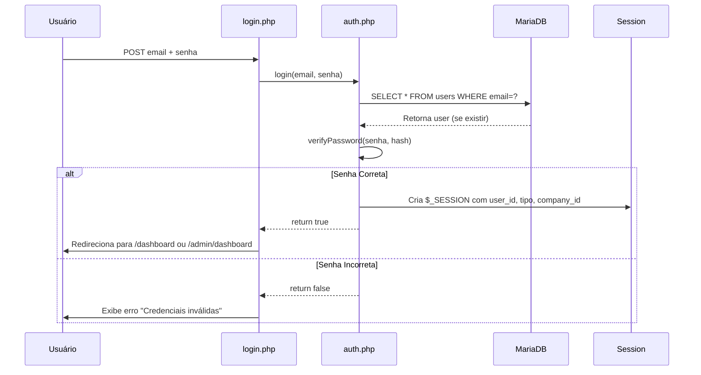
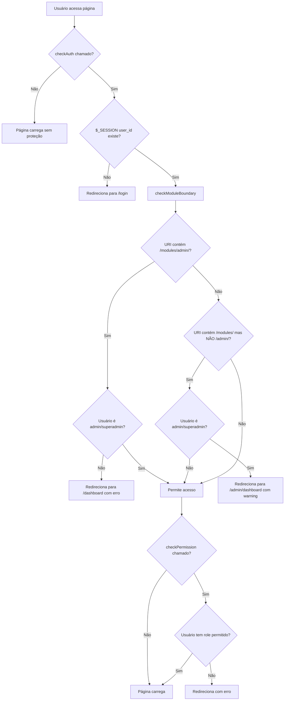

# Documentação Técnica - Sistema de Permissões e Autenticação

**Caminho**: `includes/auth.php`  
**Versão**: 1.0  
**Última Atualização**: Janeiro 2026

---

## 1. Visão Geral

### 1.1. Propósito
O sistema de permissões do Consulte+ implementa **RBAC (Role-Based Access Control)** simplificado, controlando o acesso de usuários baseado em seus **tipos/roles** e **company_id** (multi-tenancy).

### 1.2. Componentes Principais
- **Autenticação**: Verificação de identidade (login/logout)
- **Autorização**: Controle de acesso baseado em roles
- **Multi-Tenancy**: Isolamento de dados por empresa (`company_id`)
- **Module Boundary**: Separação física entre áreas Admin e Cliente

### 1.3. Tipos de Usuário (Roles)
| Role | Descrição | Acesso |
|:---|:---|:---|
| `superadmin` | Administrador supremo | Acesso total, bypass de todas as restrições |
| `admin` | Administrador | Área administrativa + gestão de conteúdo |
| `cliente` | Cliente final | Apenas módulos de usuário (gestão, produtos, perfil) |

---

## 2. Arquitetura e Estrutura

### 2.1. Arquivo Principal
```
includes/
└── auth.php                     # Todas as funções de autenticação/autorização
```

### 2.2. Funções Disponíveis

| Função | Propósito | Uso Típico |
|:---|:---|:---|
| `checkAuth()` | Verifica se usuário está logado | Início de páginas protegidas |
| `checkPermission($roles)` | Verifica se usuário tem role específico | Páginas admin-only |
| `checkModuleBoundary()` | Impede cruzamento Admin↔Cliente | Chamado automaticamente por `checkAuth()` |
| `login($email, $password)` | Autentica usuário | `login.php` |
| `logout()` | Encerra sessão | Botão de logout |
| `getCurrentUser()` | Retorna dados do usuário logado | Exibir nome, email, etc. |
| `getCompanyId()` | Retorna ID da empresa do usuário | Queries multi-tenant |

---

## 3. Fluxo de Autenticação

### 3.1. Login (Diagrama de Sequência)



**Código Simplificado**:
```php
// login.php
if ($_SERVER['REQUEST_METHOD'] === 'POST') {
    if (login($_POST['email'], $_POST['password'])) {
        redirect('dashboard'); // Ou admin/dashboard se for admin
    } else {
        $error = "Credenciais inválidas";
    }
}
```

---

### 3.2. Verificação de Acesso (checkAuth + checkPermission)



---

## 4. Banco de Dados e Sessão

### 4.1. Tabela `users`

**Colunas Críticas para Permissões**:
| Coluna | Tipo | Descrição |
|:---|:---|:---|
| `id` | INT PK | Identificador único |
| `email` | VARCHAR(100) UNIQUE | Login |
| `senha` | VARCHAR(255) | Hash bcrypt da senha |
| `tipo` | ENUM | **'superadmin', 'admin', 'cliente'** |
| `company_id` | INT FK | Vínculo com empresa (multi-tenancy) |
| `ativo` | BOOLEAN | Se false, login é bloqueado |

**Observação**: O schema antigo (`database/lixeira/sqls/schema.sql`) mostra tipos diferentes (`'admin', 'medico', 'secretaria'`), mas o sistema atual usa `'superadmin', 'admin', 'cliente'`.

---

### 4.2. Variáveis de Sessão

Após login bem-sucedido, `$_SESSION` contém:
```php
$_SESSION = [
    'user_id' => 123,
    'nome' => 'João Silva',
    'email' => 'joao@empresa.com',
    'tipo' => 'cliente',  // ou 'admin', 'superadmin'
    'company_id' => 5
];
```

**Segurança da Sessão**:
- `session.cookie_httponly = 1` (previne XSS)
- `session.use_only_cookies = 1` (previne session fixation)
- `session.cookie_secure = 0` (⚠️ **MUDAR PARA 1 EM PRODUÇÃO COM HTTPS**)

---

## 5. Regras de Negócio

### 5.1. Module Boundary (Separação Admin/Cliente)

**Regra 1: Cliente NÃO pode acessar `/modules/admin/`**
```php
// auth.php linha 38-44
if (strpos($uri, '/modules/admin/') !== false) {
    if (!$isAdmin) {
        $_SESSION['error'] = 'Acesso não autorizado à área administrativa.';
        redirect('dashboard');
    }
}
```

**Regra 2: Admin NÃO pode acessar `/modules/` (área cliente)**
```php
// auth.php linha 49-57
if (strpos($uri, '/modules/') !== false && strpos($uri, '/modules/admin/') === false) {
    if ($isAdmin) {
        $_SESSION['warning'] = 'Administradores devem usar a área administrativa.';
        redirect('admin/dashboard');
    }
}
```

**Exceções**:
- Linha 52 (comentada): Há código preparado para permitir "simulação" de cliente por admin, mas está desabilitado.

---

### 5.2. Superadmin Bypass

```php
// auth.php linha 67-70
if ($_SESSION['tipo'] === 'superadmin') {
    return; // Bypass total
}
```

O superadmin **ignora** todas as verificações de `checkPermission()`, mas **não** ignora `checkModuleBoundary()` (por design, para forçar uso da área admin).

---

### 5.3. Multi-Tenancy (Isolamento por Empresa)

**Implementação**:
Todas as queries que buscam dados devem filtrar por `company_id`:
```php
$companyId = getCompanyId(); // Retorna $_SESSION['company_id']
$sql = "SELECT * FROM gestao_tarefas WHERE company_id = ?";
```

**Problema Atual**:
- ⚠️ Nem todos os módulos implementam corretamente o filtro `company_id`.
- ⚠️ Alguns módulos legados não têm a coluna `company_id` nas tabelas.

---

## 6. Exemplos de Uso

### 6.1. Proteger Página Simples (Apenas Login)
```php
<?php
require_once __DIR__ . '/../../includes/auth.php';
checkAuth(); // Redireciona para login se não autenticado

// Código da página aqui
?>
```

---

### 6.2. Proteger Página Admin-Only
```php
<?php
require_once __DIR__ . '/../../includes/auth.php';
checkPermission(['admin', 'superadmin']);

// Apenas admins chegam aqui
?>
```

---

### 6.3. Exibir Conteúdo Condicional por Role
```php
<?php
$user = getCurrentUser();
?>

<h1>Bem-vindo, <?= $user['nome'] ?></h1>

<?php if ($user['tipo'] === 'admin'): ?>
    <a href="/admin/usuarios">Gerenciar Usuários</a>
<?php endif; ?>
```

---

### 6.4. Query Multi-Tenant Segura
```php
$companyId = getCompanyId();
$stmt = $conn->prepare("SELECT * FROM produtos WHERE company_id = ? AND ativo = 1");
$stmt->bind_param("i", $companyId);
$stmt->execute();
```

---

## 7. Análise Técnica e Dívida

### 7.1. Segurança

#### 🔴 CRÍTICO
- [ ] **Session Fixation**: Falta `session_regenerate_id()` após login bem-sucedido.
  ```php
  // Adicionar em auth.php linha 99 (após login):
  session_regenerate_id(true);
  ```

- [ ] **HTTPS Obrigatório**: `session.cookie_secure = 0` permite roubo de sessão via HTTP.
  ```php
  // Mudar linha 6 para:
  ini_set('session.cookie_secure', 1);
  ```

- [ ] **Timeout de Sessão**: Não há expiração automática. Sessão dura até fechar navegador.
  ```php
  // Adicionar em checkAuth():
  if (isset($_SESSION['last_activity']) && (time() - $_SESSION['last_activity'] > 1800)) {
      logout(); // 30 minutos de inatividade
  }
  $_SESSION['last_activity'] = time();
  ```

#### 🟡 MÉDIO
- [ ] **Brute Force**: Não há limitação de tentativas de login.
  - **Sugestão**: Implementar rate limiting (ex: 5 tentativas por IP a cada 15 minutos).

- [ ] **Password Policy**: Não há validação de complexidade de senha.
  - **Sugestão**: Exigir mínimo 8 caracteres, 1 maiúscula, 1 número.

#### 🟢 BAIXO
- [ ] **Audit Log**: Não há registro de logins/logouts.
  - **Sugestão**: Criar tabela `audit_log` para rastrear acessos.

---

### 7.2. Arquitetura

#### 🟠 ALTO IMPACTO
- [ ] **Falta de Granularidade**: Apenas 3 roles (superadmin, admin, cliente). Não há permissões específicas (ex: "pode_editar_usuarios", "pode_ver_relatorios").
  
  **Sugestão**: Implementar ACL (Access Control List):
  ```sql
  CREATE TABLE permissions (
      id INT PRIMARY KEY,
      name VARCHAR(50) UNIQUE -- 'edit_users', 'view_reports'
  );
  
  CREATE TABLE role_permissions (
      role ENUM('superadmin', 'admin', 'cliente'),
      permission_id INT,
      FOREIGN KEY (permission_id) REFERENCES permissions(id)
  );
  ```

- [ ] **Module Boundary Hardcoded**: A lógica de separação Admin/Cliente está fixa no código (linhas 38-57). Dificulta customização.
  
  **Sugestão**: Mover para configuração em banco ou arquivo JSON.

#### 🟢 BAIXO IMPACTO
- [ ] **Função `verifyPassword()` Não Existe**: Linha 93 chama `verifyPassword()`, mas a função não está definida em `auth.php`.
  
  **Provável Localização**: `includes/functions.php` ou inline:
  ```php
  function verifyPassword($input, $hash) {
      return password_verify($input, $hash);
  }
  ```

---

### 7.3. Multi-Tenancy

#### 🔴 CRÍTICO
- [ ] **Inconsistência de `company_id`**: Nem todas as tabelas têm a coluna.
  
  **Tabelas SEM `company_id` (risco de vazamento de dados)**:
  - `gestao_diagnostico_modelos`
  - `gestao_diagnostico_perguntas`
  - `configuracoes` (global, OK)
  
  **Sugestão**: Adicionar `company_id` onde necessário ou documentar quais tabelas são globais.

- [ ] **Fallback Perigoso**: Linha 128 e 137 usam `?? 1` como fallback.
  ```php
  'company_id' => $_SESSION['company_id'] ?? 1 // ⚠️ Se sessão não tem, assume empresa 1
  ```
  
  **Problema**: Se `$_SESSION['company_id']` não existir, usuário acessa dados da empresa 1.
  
  **Sugestão**: Lançar erro ao invés de fallback:
  ```php
  if (!isset($_SESSION['company_id'])) {
      throw new Exception('company_id não definido na sessão');
  }
  ```

---

## 8. Guia de Troubleshooting

### 8.1. "Usuário não consegue logar"
**Checklist**:
1. Verificar se `users.ativo = 1`.
2. Testar senha manualmente:
   ```php
   var_dump(password_verify('senha_digitada', $hash_do_banco));
   ```
3. Verificar se `email` está correto (case-sensitive em alguns bancos).

---

### 8.2. "Admin é redirecionado para área cliente"
**Causa**: `checkModuleBoundary()` força admin a usar `/modules/admin/`.

**Solução**: Admin deve acessar `/modules/admin/dashboard` ao invés de `/modules/dashboard`.

---

### 8.3. "Cliente vê dados de outra empresa"
**Causa Provável**: Query sem filtro `company_id`.

**Debug**:
```php
// Adicionar no início da página:
error_log("Company ID da sessão: " . getCompanyId());
error_log("Query executada: " . $sql);
```

---

## 9. Roadmap de Melhorias

### Fase 1 (Urgente - 1 Sprint)
1. ✅ Implementar `session_regenerate_id()` após login
2. ✅ Adicionar timeout de sessão (30 min)
3. ✅ Habilitar `session.cookie_secure` em produção
4. ✅ Corrigir fallback de `company_id` (lançar erro)

### Fase 2 (Importante - 2 Sprints)
5. ⬜ Implementar rate limiting no login
6. ⬜ Criar audit log de acessos
7. ⬜ Adicionar `company_id` em todas as tabelas necessárias

### Fase 3 (Desejável - 3 Sprints)
8. ⬜ Implementar ACL (permissões granulares)
9. ⬜ Criar interface de gestão de permissões
10. ⬜ Implementar 2FA (Two-Factor Authentication)

---

## 10. Matriz de Permissões Atual

| Módulo/Funcionalidade | Superadmin | Admin | Cliente |
|:---|:---:|:---:|:---:|
| **Dashboard** | ✅ (Admin) | ✅ (Admin) | ✅ (Cliente) |
| **Gestão (Diagnóstico, Projetos)** | ❌* | ❌* | ✅ |
| **Produtos (LMS)** | ❌* | ❌* | ✅ |
| **Admin > Usuários** | ✅ | ✅ | ❌ |
| **Admin > Produtos (Gestão)** | ✅ | ✅ | ❌ |
| **Admin > Configurações** | ✅ | ✅ | ❌ |
| **Deploy** | ✅ | ❌ | ❌ |

**\*Nota**: Admins são **bloqueados** de acessar área cliente por `checkModuleBoundary()`. Isso pode ser flexibilizado descomentando linha 52 para permitir "simulação".

---

## 11. Referências e Contatos

**Arquivo Principal**: `includes/auth.php`  
**Responsável**: [Dev Backend]  
**Última Revisão de Segurança**: Pendente

**Links Relacionados**:
- [OWASP Session Management](https://cheatsheetseries.owasp.org/cheatsheets/Session_Management_Cheat_Sheet.html)
- [PHP password_hash() Docs](https://www.php.net/manual/en/function.password-hash.php)

---

*Documento vivo. Última revisão: 24/01/2026*
