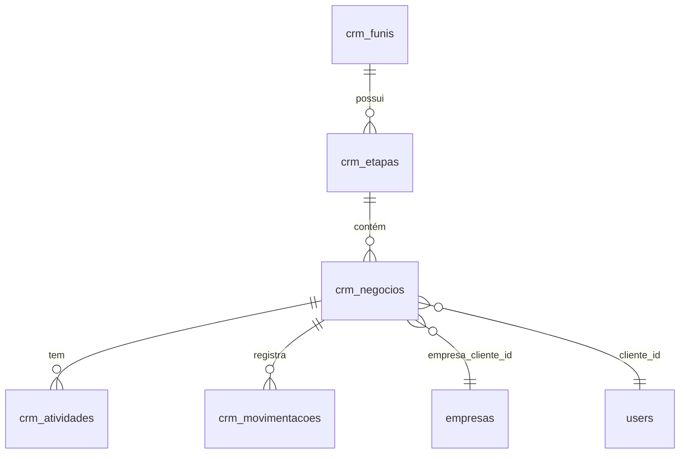
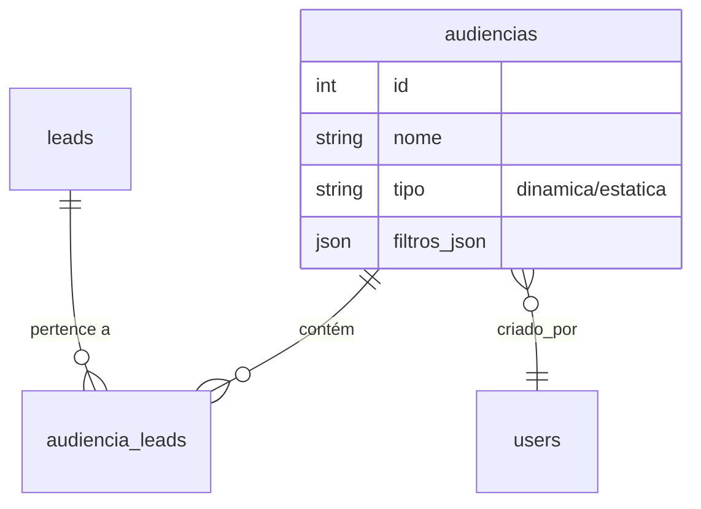
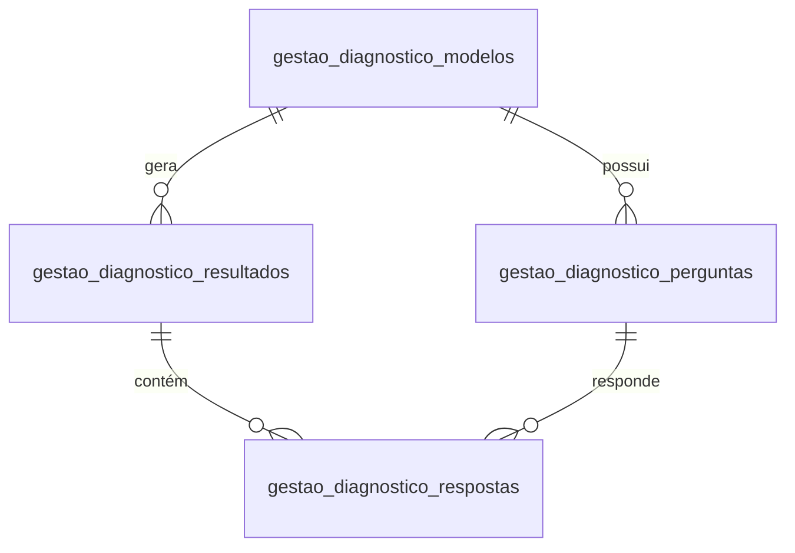
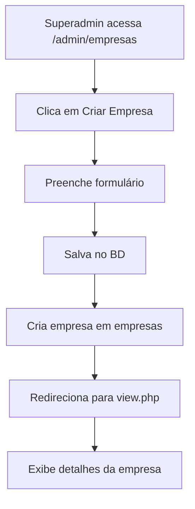
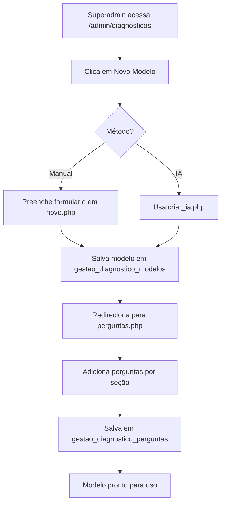
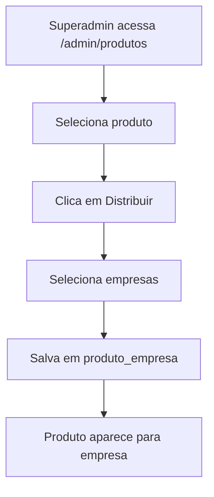
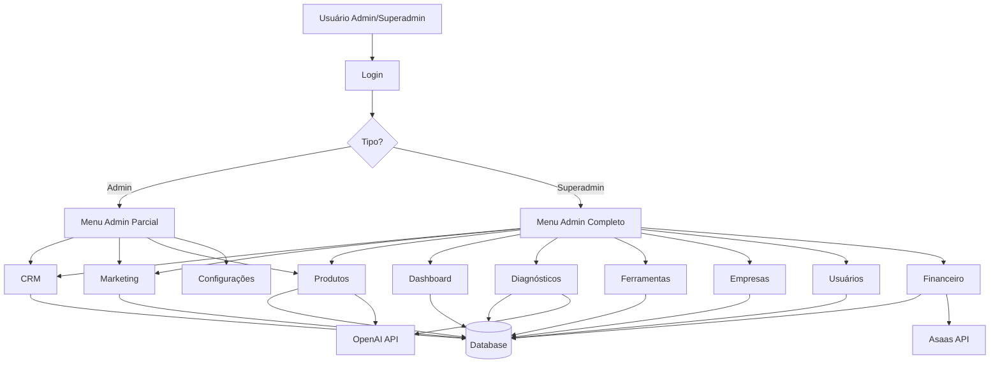

# Documentação Técnica - Módulo Admin

**Sistema**: Consulte+  
**Módulo**: Painel Administrativo  
**Caminho**: `modules/admin/`  
**Última Atualização**: Janeiro 2026

---

## 1. Visão Geral

### 1.1. Propósito
O **Módulo Admin** é o **painel de controle central** do sistema Consulte+, responsável por toda a **gestão administrativa** e **operações de backoffice**. Ele permite que administradores e superadministradores gerenciem empresas, usuários, produtos, diagnósticos, CRM, marketing e financeiro.

### 1.2. Níveis de Acesso

| Tipo de Usuário | Acesso | Descrição |
|:---|:---|:---|
| **superadmin** | Total | Acesso completo a todos os módulos administrativos |
| **admin** | Parcial | Acesso a CRM, Marketing, Produtos e Configurações da própria empresa |
| **cliente** | Negado | Bloqueado pelo `checkModuleBoundary()` |

---

### 1.3. Estrutura de Diretórios

```
modules/admin/
├── header.php                 # Cabeçalho específico do admin
├── menu.php                   # Menu lateral (deprecated, usar menu_items.php)
├── menu_items.php            # Itens de menu dinâmicos (incluído no menu principal)
│
├── dashboard/                # Dashboard administrativo
│   └── index.php
│
├── crm/                      # CRM - Pipeline de Vendas
│   ├── index.php            # Kanban/Lista de negócios
│   ├── config.php           # Configuração de funis e etapas
│   ├── detalhes.php         # Detalhes de um negócio
│   ├── acoes.php            # API AJAX (mover, criar, editar)
│   └── DOCS.md
│
├── marketing/                # Marketing e Leads
│   ├── leads/               # Gestão de leads
│   ├── gerador_leads/       # Gerador automático de leads
│   ├── import/              # Importação de leads
│   ├── audiencias/          # Segmentação de leads (Audiências)
│   └── DOCS.md
│
├── produtos/                 # Gestão de Produtos (Mentorias, Cursos)
│   ├── index.php            # Listagem de produtos
│   ├── produto.php          # Edição de produto
│   ├── conteudo.php         # Gestão de conteúdo (módulos/aulas)
│   ├── trilhas.php          # Trilhas de aprendizagem
│   ├── distribuir.php       # Distribuição de produtos para empresas
│   ├── ia_generator.php     # Gerador de conteúdo com IA
│   ├── ia_modulo_generator.php
│   ├── salvar_ia.php
│   └── DOCS.md
│
├── diagnosticos/             # Gestão de Modelos de Diagnóstico
│   ├── index.php            # Listagem de modelos
│   ├── novo.php             # Criar novo modelo
│   ├── editar.php           # Editar modelo
│   ├── perguntas.php        # Gerenciar perguntas
│   ├── atribuir.php         # Atribuir diagnóstico a empresas
│   ├── criar_ia.php         # Criar modelo com IA
│   ├── criar_completo.php
│   ├── atualizar_completo.php
│   ├── salvar_perguntas_ia.php
│   ├── reordenar_perguntas.php
│   ├── reordenar_secoes.php
│   └── DOCS.md
│
├── ferramentas/              # Gestão de Ferramentas (SWOT, Porter, etc)
│   ├── index.php
│   ├── editar.php
│   ├── atribuir.php
│   └── (4 arquivos)
│
├── empresas/                 # Gestão de Empresas (Multi-tenancy)
│   ├── index.php            # Listagem de empresas
│   ├── view.php             # Visualizar empresa
│   └── (3 arquivos)
│
├── usuarios/                 # Gestão de Usuários
│   ├── index.php            # Listagem de usuários
│   ├── acoes.php            # CRUD de usuários
│   └── (3 arquivos)
│
└── financeiro/               # Gestão Financeira
    ├── index.php            # Visão geral financeira
    ├── nova_assinatura.php  # Criar assinatura
    └── (3 arquivos)
```

---

## 2. Arquivos Principais

### 2.1. `menu_items.php` - Menu Dinâmico

**Localização**: `modules/admin/menu_items.php`  
**Linhas**: 246

#### Responsabilidade
Define os **itens de menu** do painel administrativo que são incluídos dinamicamente no menu principal (`includes/menu.php`).

#### Estrutura

```php
<?php
// modules/admin/menu_items.php
// Itens de menu compartilhados (Administração e SuperAdmin)
?>

<!-- ADMINISTRAÇÃO (GESTORES / ADMINS) -->
<?php if (hasPermission(['admin']) && (!isset($_SESSION['tipo']) || $_SESSION['tipo'] !== 'superadmin')): ?>
    
    <li class="nav-item ps-3 mb-2 mt-3 hide-on-mini">
        <small class="text-uppercase text-white-50 fw-bold">
            <i class="bi bi-shield-lock me-1"></i> Administração
        </small>
    </li>

    <!-- CRM (Pipeline + Config) -->
    <li class="nav-item">
        <a class="nav-link d-flex align-items-center justify-content-between" 
           href="#submenuCRM" data-bs-toggle="collapse">
            <span><i class="bi bi-kanban me-2"></i> CRM</span>
            <i class="bi bi-chevron-down"></i>
        </a>
        <div class="collapse" id="submenuCRM">
            <ul class="nav flex-column ms-3">
                <li class="nav-item my-1">
                    <a class="nav-link py-1" href="<?php echo BASE_URL; ?>admin/crm">
                        <i class="bi bi-view-list me-2"></i> Pipeline
                    </a>
                </li>
                <li class="nav-item my-1">
                    <a class="nav-link py-1" href="<?php echo BASE_URL; ?>admin/crm/config">
                        <i class="bi bi-gear me-2"></i> Configurações
                    </a>
                </li>
            </ul>
        </div>
    </li>

    <!-- Marketing -->
    <!-- Produtos -->
    <!-- Configurações -->

<?php endif; ?>

<!-- SUPER ADMINISTRAÇÃO (GLOBAL) -->
<?php if (isset($_SESSION['tipo']) && $_SESSION['tipo'] === 'superadmin'): ?>
    
    <!-- Dashboard -->
    <!-- Comercial (CRM) -->
    <!-- Marketing -->
    <!-- Produtos (Produtos, Diagnósticos, Ferramentas) -->
    <!-- Sistema (Empresas + Usuários) -->
    <!-- Financeiro -->

<?php endif; ?>
```

---

#### Diferenças entre Admin e Superadmin

| Funcionalidade | Admin | Superadmin |
|:---|:---:|:---:|
| Dashboard | ❌ | ✅ |
| CRM | ✅ | ✅ |
| Marketing | ✅ | ✅ |
| Produtos | ✅ | ✅ |
| Diagnósticos | ❌ | ✅ |
| Ferramentas | ❌ | ✅ |
| Empresas | ❌ | ✅ |
| Usuários | ❌ | ✅ |
| Financeiro | ❌ | ✅ |
| Configurações | ✅ | ❌ |

---

### 2.2. `header.php` - Cabeçalho Admin

**Localização**: `modules/admin/header.php`

#### Responsabilidade
Cabeçalho específico para o painel administrativo, com estilos e scripts adicionais.

**⚠️ Nota**: Atualmente, a maioria das páginas admin usa `includes/header.php` diretamente. Este arquivo pode estar deprecated.

---

## 3. Submódulos

### 3.1. Dashboard (`dashboard/`)

**Arquivo Principal**: `dashboard/index.php`

#### Funcionalidades
- **Estatísticas Gerais**:
  - Total de Empresas (+ novos últimos 7 dias)
  - Total de Usuários (+ novos últimos 7 dias)
  - Total de Diagnósticos Realizados (+ novos últimos 7 dias)
  - Total de Modelos de Diagnóstico (+ novos últimos 7 dias)

- **Gráfico de Evolução**:
  - Faturamento de novas assinaturas (últimos 6 meses)
  - Usando **Chart.js** com gradiente

- **Feed de Atividades**:
  - Últimos 5 eventos (novos usuários, diagnósticos realizados)
  - UNION query entre `users` e `gestao_diagnostico_resultados`

---

#### Queries Principais

```php
// Total de Empresas
$totalEmpresas = $conn->query("SELECT COUNT(*) as c FROM empresas")->fetch_assoc()['c'];
$newEmpresas = $conn->query("SELECT COUNT(*) as c FROM empresas WHERE created_at >= DATE_SUB(NOW(), INTERVAL 7 DAY)")->fetch_assoc()['c'];

// Total de Usuários
$totalUsers = $conn->query("SELECT COUNT(*) as c FROM users")->fetch_assoc()['c'];
$newUsers = $conn->query("SELECT COUNT(*) as c FROM users WHERE created_at >= DATE_SUB(NOW(), INTERVAL 7 DAY)")->fetch_assoc()['c'];

// Total de Diagnósticos
$totalDiags = $conn->query("SELECT COUNT(*) as c FROM gestao_diagnostico_resultados")->fetch_assoc()['c'];
$newDiags = $conn->query("SELECT COUNT(*) as c FROM gestao_diagnostico_resultados WHERE data_realizacao >= DATE_SUB(NOW(), INTERVAL 7 DAY)")->fetch_assoc()['c'];

// Faturamento por Mês (últimos 6 meses)
$sqlRevenue = "SELECT SUM(valor) as total 
               FROM financeiro_assinaturas 
               WHERE DATE_FORMAT(created_at, '%Y-%m') = '$date' 
               AND status != 'CANCELLED'";
```

---

#### Gráfico Chart.js

```javascript
const myChart = new Chart(ctx, {
    type: 'line',
    data: {
        labels: <?php echo json_encode($months); ?>,
        datasets: [{
            label: 'Faturamento de Novos Contratos (R$)',
            data: <?php echo json_encode($revenues); ?>,
            backgroundColor: gradient,
            borderColor: '#0d6efd',
            fill: true,
            tension: 0.4
        }]
    },
    options: {
        responsive: true,
        maintainAspectRatio: false,
        // ... tooltips, scales
    }
});
```

---

### 3.2. CRM (`crm/`)

**Documentação Completa**: [crm/DOCS.md](file:///c:/xampp/htdocs/consulteplus/modules/admin/crm/DOCS.md)

#### Arquivos

| Arquivo | Descrição |
|:---|:---|
| `index.php` | Pipeline Kanban/Lista de negócios |
| `config.php` | Configuração de funis e etapas |
| `detalhes.php` | Detalhes de um negócio específico |
| `acoes.php` | API AJAX (mover, criar, editar negócios) |

---

#### Funcionalidades Principais

##### **Pipeline Kanban**
- Visualização de negócios por etapa (drag & drop)
- Filtros: busca, status, responsável
- Paginação por etapa ("Carregar mais")

##### **Configuração de Funis**
- CRUD de funis de vendas
- CRUD de etapas (nome, cor, ordem, probabilidade)
- Reordenação de etapas

##### **Detalhes do Negócio**
- Informações completas (título, valor, cliente, empresa)
- Timeline de atividades
- Adicionar notas e tarefas
- Edição inline de campos

---

#### Tabelas Relacionadas



---

#### Dívida Técnica (CRM)

⚠️ **Problemas Identificados**:
- [ ] **SQL Injection Risk**: Concatenação manual em filtros
- [ ] **Lógica Mista**: HTML + SQL no mesmo arquivo
- [ ] **Inline CSS/JS**: Blocos grandes no final dos arquivos
- [ ] **Debug Log**: Arquivo `debug_crm_log.txt` deve ser removido
- [ ] **Validação Fraca**: Sanitização básica em `acoes.php`

**Refatorações Recomendadas**:
1. Criar `CrmService.php` para isolar lógica de DB
2. Mover CSS/JS para `assets/css/crm.css` e `assets/js/crm.js`
3. Implementar logging PSR-3
4. Usar prepared statements em todos os queries

---

### 3.3. Marketing (`marketing/`)

**Documentação Completa**: [marketing/DOCS.md](file:///c:/xampp/htdocs/consulteplus/modules/admin/marketing/DOCS.md)

#### Submódulos

##### **Base de Leads** (`leads/`)
- Listagem de leads capturados
- Filtros e busca
- Exportação

##### **Gerador de Leads** (`gerador_leads/`)
- Geração automática de leads com IA
- Integração com APIs externas
- Validação de dados

##### **Importação** (`import/`)
- Upload de CSV/Excel
- Mapeamento de campos
- Validação e deduplicação

##### **Audiências** (`audiencias/`)
- **Segmentação Dinâmica**: Filtros salvos em JSON que são aplicados em tempo real na listagem.
- **Segmentação Estática**: Snapshot de leads no momento da criação (tabela `audiencia_leads`).
- **Templates**: Presets de filtros comuns (ex: "Novos 30 dias", "Sem email").
- **Preview**: Visualização em tempo real dos leads filtrados antes de salvar.

---

#### Tabelas Relacionadas (Marketing)



---

### 3.4. Produtos (`produtos/`)

**Documentação Completa**: [produtos/DOCS.md](file:///c:/xampp/htdocs/consulteplus/modules/admin/produtos/DOCS.md)

#### Arquivos Principais

| Arquivo | Descrição |
|:---|:---|
| `index.php` | Listagem de produtos (mentorias, cursos) |
| `produto.php` | Edição de produto (nome, descrição, preço) |
| `conteudo.php` | Gestão de módulos e aulas |
| `trilhas.php` | Trilhas de aprendizagem |
| `distribuir.php` | Distribuir produtos para empresas |
| `ia_generator.php` | Gerador de conteúdo com IA |
| `ia_modulo_generator.php` | Gerador de módulos com IA |
| `salvar_ia.php` | Salvar conteúdo gerado por IA |

---

#### Funcionalidades

##### **Gestão de Produtos**
- CRUD de produtos (mentorias, cursos, workshops)
- Definição de preço, duração, nível
- Upload de imagens e materiais

##### **Gestão de Conteúdo**
- Criar módulos (capítulos)
- Criar aulas (vídeos, textos, PDFs)
- Ordenação drag & drop
- Preview de conteúdo

##### **Trilhas de Aprendizagem**
- Agrupar produtos em trilhas
- Definir pré-requisitos
- Certificados de conclusão

##### **Distribuição**
- Atribuir produtos a empresas específicas
- Controle de acesso por `company_id`
- Histórico de distribuição

##### **Gerador com IA**
- Gerar conteúdo de aulas automaticamente
- Gerar estrutura de módulos
- Revisão e edição manual

---

### 3.5. Diagnósticos (`diagnosticos/`)

**Documentação Completa**: [diagnosticos/DOCS.md](file:///c:/xampp/htdocs/consulteplus/modules/admin/diagnosticos/DOCS.md)

#### Arquivos Principais

| Arquivo | Descrição |
|:---|:---|
| `index.php` | Listagem de modelos de diagnóstico |
| `novo.php` | Criar novo modelo |
| `editar.php` | Editar modelo existente |
| `perguntas.php` | Gerenciar perguntas do modelo |
| `atribuir.php` | Atribuir diagnóstico a empresas |
| `criar_ia.php` | Criar modelo com IA |
| `criar_completo.php` | Criar modelo completo (wizard) |
| `atualizar_completo.php` | Atualizar modelo completo |
| `salvar_perguntas_ia.php` | Salvar perguntas geradas por IA |
| `reordenar_perguntas.php` | Reordenar perguntas |
| `reordenar_secoes.php` | Reordenar seções |

---

#### Funcionalidades

##### **Gestão de Modelos**
- CRUD de modelos de diagnóstico
- Definir título, descrição, objetivo
- Ativar/desativar modelos

##### **Gestão de Perguntas**
- Criar perguntas por seção
- Tipos: escala, seleção, texto, número, múltipla
- Definir opções (JSON)
- Lógica para IA (contexto)
- Reordenação drag & drop

##### **Atribuição**
- Atribuir modelos a empresas específicas
- Controle de acesso por `company_id`

##### **Gerador com IA**
- Gerar perguntas automaticamente
- Gerar seções e estrutura
- Revisão e edição manual

---

#### Tabelas Relacionadas



---

### 3.6. Ferramentas (`ferramentas/`)

#### Arquivos

| Arquivo | Descrição |
|:---|:---|
| `index.php` | Listagem de ferramentas (SWOT, Porter, BSC, etc) |
| `editar.php` | Editar ferramenta |
| `atribuir.php` | Atribuir ferramenta a empresas |

---

#### Funcionalidades

##### **Gestão de Ferramentas**
- CRUD de ferramentas estratégicas
- Tipos: SWOT, Porter, BSC, PESTEL, 4Ps, 5W2H, BCG, Canvas
- Definir nome, descrição, ícone
- Ativar/desativar

##### **Atribuição**
- Atribuir ferramentas a empresas
- Controle de acesso

---

### 3.7. Empresas (`empresas/`)

#### Arquivos

| Arquivo | Descrição |
|:---|:---|
| `index.php` | Listagem de empresas |
| `view.php` | Visualizar empresa (detalhes, usuários, diagnósticos) |

---

#### Funcionalidades

##### **Gestão de Empresas**
- Listagem com filtros e busca
- Criar nova empresa
- Editar informações (nome, documento, Asaas ID)
- Ativar/desativar empresa

##### **Visualização Detalhada**
- Informações da empresa
- Usuários vinculados
- Diagnósticos realizados
- Produtos atribuídos
- Histórico de atividades

---

### 3.8. Usuários (`usuarios/`)

#### Arquivos

| Arquivo | Descrição |
|:---|:---|
| `index.php` | Listagem de usuários |
| `acoes.php` | CRUD de usuários (API AJAX) |

---

#### Funcionalidades

##### **Gestão de Usuários**
- Listagem com filtros (tipo, empresa, status)
- Criar novo usuário
- Editar informações (nome, email, tipo, empresa)
- Resetar senha
- Ativar/desativar usuário

##### **Tipos de Usuário**
- `superadmin` - Acesso total
- `admin` - Administrador de empresa
- `cliente` - Usuário final

---

### 3.9. Financeiro (`financeiro/`)

#### Arquivos

| Arquivo | Descrição |
|:---|:---|
| `index.php` | Visão geral financeira |
| `nova_assinatura.php` | Criar nova assinatura |

---

#### Funcionalidades

##### **Gestão de Assinaturas**
- Listagem de assinaturas ativas
- Criar nova assinatura (integração Asaas)
- Editar assinatura
- Cancelar assinatura
- Histórico de pagamentos

##### **Visão Geral**
- Total de assinaturas ativas
- Receita mensal recorrente (MRR)
- Gráfico de evolução
- Inadimplência

---

## 4. Fluxos de Trabalho

### 4.1. Criar Nova Empresa



---

### 4.2. Criar Modelo de Diagnóstico



---

### 4.3. Distribuir Produto para Empresa



---

## 5. Segurança e Permissões

### 5.1. Verificação de Acesso

**Todas as páginas admin** devem ter:

```php
<?php
require_once __DIR__ . '/../../includes/header.php';
checkPermission(['admin', 'superadmin']); // ou apenas ['superadmin']
?>
```

---

### 5.2. Fronteiras de Módulos

**Implementado em** `includes/auth.php`:

```php
function checkModuleBoundary() {
    $uri = str_replace('\\', '/', $_SERVER['REQUEST_URI']);
    $role = $_SESSION['tipo'];
    $isAdmin = in_array($role, ['admin', 'superadmin']);
    
    // Bloquear Cliente na área Admin
    if (strpos($uri, '/modules/admin/') !== false) {
        if (!$isAdmin) {
            $_SESSION['error'] = 'Acesso não autorizado à área administrativa.';
            redirect('dashboard');
        }
    }
}
```

---

### 5.3. Multi-Tenancy

**Sempre filtrar por `company_id`**:

```php
$companyId = $_SESSION['company_id'];

// Admin: vê apenas sua empresa
if ($_SESSION['tipo'] === 'admin') {
    $sql = "SELECT * FROM crm_negocios WHERE company_id = ?";
    $stmt = $conn->prepare($sql);
    $stmt->bind_param("i", $companyId);
}

// Superadmin: vê todas as empresas
if ($_SESSION['tipo'] === 'superadmin') {
    $sql = "SELECT * FROM crm_negocios";
}
```

---

## 6. APIs AJAX

### 6.1. CRM - `acoes.php`

**Endpoint**: `modules/admin/crm/acoes.php`

#### Ações Disponíveis

| Ação | Método | Parâmetros | Descrição |
|:---|:---|:---|:---|
| `mover_etapa` | POST | `deal_id`, `etapa_id` | Move negócio para outra etapa |
| `criar_negocio` | POST | `titulo`, `funil_id`, `etapa_id`, ... | Cria novo negócio |
| `editar_negocio` | POST | `id`, `campo`, `valor` | Edita campo de negócio |
| `buscar_negocio` | GET | `id` | Retorna dados de negócio |
| `adicionar_atividade` | POST | `negocio_id`, `tipo`, `descricao` | Adiciona atividade |

---

#### Exemplo de Uso

```javascript
// Mover negócio para outra etapa
$.ajax({
    url: 'acoes.php',
    method: 'POST',
    data: {
        acao: 'mover_etapa',
        deal_id: 123,
        etapa_id: 5
    },
    success: function(response) {
        console.log('Negócio movido com sucesso');
    }
});
```

---

### 6.2. Usuários - `acoes.php`

**Endpoint**: `modules/admin/usuarios/acoes.php`

#### Ações Disponíveis

| Ação | Método | Parâmetros | Descrição |
|:---|:---|:---|:---|
| `criar` | POST | `nome`, `email`, `tipo`, `company_id` | Cria novo usuário |
| `editar` | POST | `id`, `campo`, `valor` | Edita campo de usuário |
| `deletar` | POST | `id` | Desativa usuário |
| `resetar_senha` | POST | `id` | Reseta senha do usuário |

---

### 6.3. Audiências - `acoes.php`

**Endpoint**: `modules/admin/marketing/audiencias/acoes.php`

#### Ações Disponíveis

| Ação | Método | Parâmetros | Descrição |
|:---|:---|:---|:---|
| `listar` | GET | - | Lista todas as audiências da empresa |
| `salvar` | POST | `nome`, `tipo`, `filtros` (JSON) | Cria ou edita uma audiência e processa filtros |
| `excluir` | POST | `id` | Remove audiência (e vínculos se estática) |
| `preview` | POST | `filtros` (JSON) | Retorna contagem e amostra de leads para os filtros |
| `leads` | GET | `id` | Retorna todos os leads de uma audiência salva |

**Nota sobre Filtros**: O backend utiliza `LOWER()` em todas as comparações de string para garantir buscas case-insensitive (ex: "WhatsApp" == "whatsapp").

---

## 7. Integrações

### 7.1. Asaas (Pagamentos)

**Tabela**: `financeiro_assinaturas`

#### Campos Importantes

| Campo | Descrição |
|:---|:---|
| `asaas_id` | ID da assinatura no Asaas (sub_...) |
| `asaas_customer_id` | ID do cliente no Asaas (cus_...) |
| `status` | ACTIVE, SUSPENDED, CANCELLED |
| `billing_type` | BOLETO, CREDIT_CARD, PIX |

---

#### Webhook

**Endpoint**: `webhooks/asaas.php` (não está em `/admin/`)

**Eventos**:
- `PAYMENT_CREATED`
- `PAYMENT_CONFIRMED`
- `PAYMENT_RECEIVED`
- `SUBSCRIPTION_CREATED`
- `SUBSCRIPTION_UPDATED`

---

### 7.2. IA (OpenAI)

**Usado em**:
- `produtos/ia_generator.php` - Gerar conteúdo de aulas
- `diagnosticos/criar_ia.php` - Gerar perguntas de diagnóstico
- `marketing/gerador_leads/` - Gerar leads

**Configuração**: `config/openai.php` (verificar se existe)

---

## 8. Boas Práticas

### 8.1. Estrutura de Arquivos

✅ **Sempre usar**:
```php
<?php
$pageTitle = "Título da Página - Admin";
require_once __DIR__ . '/../../includes/header.php';
checkPermission(['superadmin']); // ou ['admin', 'superadmin']

// Lógica da página
?>

<!-- HTML -->

<!-- HTML -->

<?php require_once __DIR__ . '/../../includes/footer.php'; ?>

<!-- Scripts DEPOIS do footer para garantir jQuery carregado -->
<script>
$(document).ready(function() {
    // ...
});
</script>
```

---

### 8.2. Queries SQL

✅ **Sempre usar prepared statements**:
```php
$stmt = $conn->prepare("SELECT * FROM crm_negocios WHERE company_id = ? AND status = ?");
$stmt->bind_param("is", $companyId, $status);
$stmt->execute();
$result = $stmt->get_result();
```

❌ **Nunca usar concatenação**:
```php
// ERRADO - SQL Injection
// ERRADO - SQL Injection
$sql = "SELECT * FROM crm_negocios WHERE company_id = $companyId";
```

✅ **Buscas Case-Insensitive**:
Ao filtrar campos de texto que podem ter variação de caixa (ex: Origem, Status), use `LOWER()`:
```php
// Correto: Encontra "WhatsApp", "whatsapp", "WHATSAPP"
$sql = "SELECT * FROM leads WHERE LOWER(origem) = LOWER(?)";
```

---

### 8.3. Respostas AJAX

✅ **Sempre retornar JSON**:
```php
header('Content-Type: application/json');
echo json_encode([
    'success' => true,
    'message' => 'Operação realizada com sucesso',
    'data' => $result
]);
exit;
```

---

### 8.4. Tratamento de Erros

✅ **Usar try-catch**:
```php
try {
    $stmt = $conn->prepare($sql);
    $stmt->bind_param("i", $id);
    $stmt->execute();
    
    $_SESSION['success'] = 'Operação realizada com sucesso';
} catch (Exception $e) {
    $_SESSION['error'] = 'Erro ao processar: ' . $e->getMessage();
    error_log($e->getMessage());
}

redirect('admin/modulo');
```

---

## 9. Troubleshooting

### 9.1. Acesso Negado

**Problema**: Usuário admin não consegue acessar `/admin/`

**Solução**:
```php
// Verificar tipo de usuário
var_dump($_SESSION['tipo']); // deve ser 'admin' ou 'superadmin'

// Verificar permissões
checkPermission(['admin', 'superadmin']);
```

---

### 9.2. Multi-Tenancy não funciona

**Problema**: Admin vê dados de outras empresas

**Solução**:
```php
// Sempre filtrar por company_id
$companyId = $_SESSION['company_id'];
$sql = "SELECT * FROM tabela WHERE company_id = ?";
```

**Exceção (Superadmin Global)**: Em alguns casos, pode ser necessário ver leads órfãos ou globais (`company_id IS NULL`).
```php
$sql = "SELECT * FROM leads WHERE (company_id = ? OR company_id IS NULL)";
```

---

### 9.3. AJAX não retorna dados

**Problema**: Requisição AJAX falha

**Solução**:
```javascript
// Verificar console do navegador
console.log(response);

// Verificar erro no PHP
error_log(print_r($error, true));

// Verificar header JSON
header('Content-Type: application/json');
```

---

## 10. Roadmap de Melhorias

### 10.1. Curto Prazo

- [ ] Refatorar CRM (separar lógica de DB)
- [ ] Remover arquivos de debug (`debug_crm_log.txt`)
- [ ] Implementar logging PSR-3
- [ ] Adicionar testes unitários

---

### 10.2. Médio Prazo

- [ ] Criar API RESTful para módulos admin
- [ ] Implementar cache (Redis/Memcached)
- [ ] Adicionar auditoria de ações (logs de alterações)
- [ ] Melhorar performance de queries (índices, otimizações)

---

### 10.3. Longo Prazo

- [ ] Migrar para arquitetura MVC
- [ ] Implementar microserviços
- [ ] Adicionar GraphQL
- [ ] Criar app mobile para admin

---

## 11. Diagrama de Arquitetura



---

## 12. Checklist de Desenvolvimento

### Nova Funcionalidade Admin

- [ ] Criar arquivo PHP em `/admin/modulo/`
- [ ] Adicionar `checkPermission(['superadmin'])` ou `['admin', 'superadmin']`
- [ ] Filtrar por `company_id` se necessário
- [ ] Usar prepared statements
- [ ] Adicionar item ao `menu_items.php`
- [ ] Criar DOCS.md no submódulo
- [ ] Testar com admin e superadmin
- [ ] Testar multi-tenancy
- [ ] Adicionar logs de auditoria

---

*Documento vivo. Última revisão: 24/01/2026*
