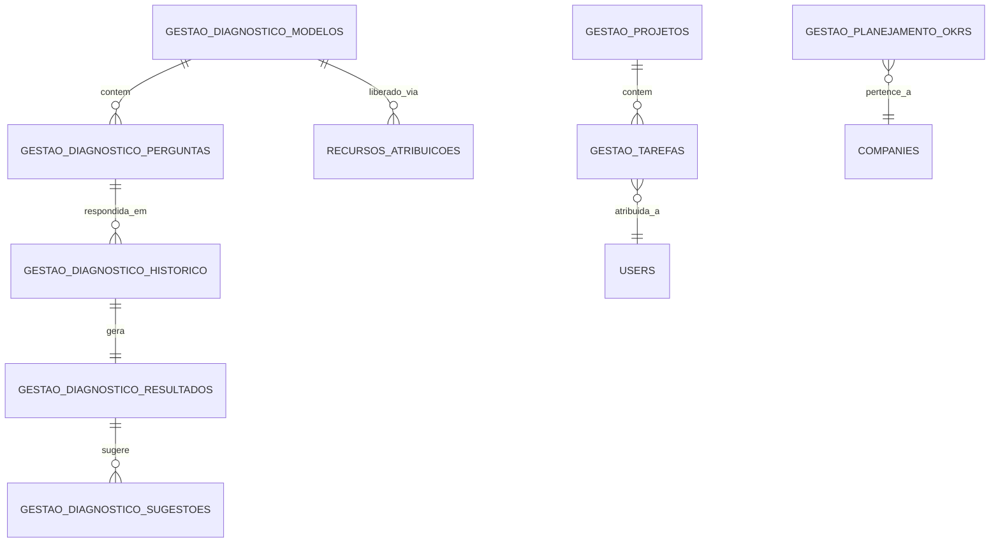
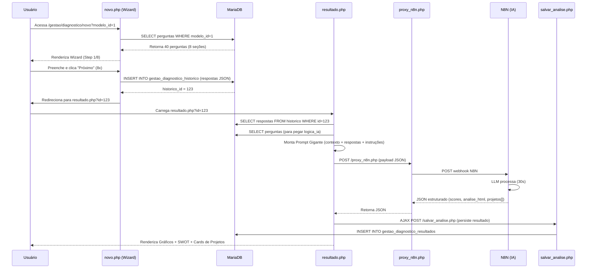
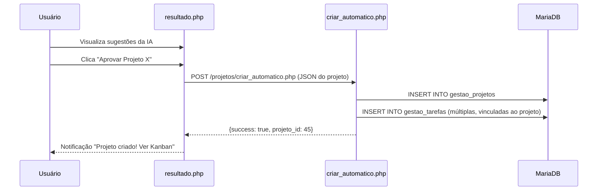

# Documentação Técnica Completa - Módulo Gestão

**Caminho**: `modules/gestao/`  
**Versão**: 2.0  
**Última Atualização**: Janeiro 2026

---

## 1. Visão Geral

### 1.1. Propósito
O módulo **Gestão** é o núcleo estratégico da plataforma Consulte+. Ele oferece um conjunto integrado de ferramentas para:
- **Diagnosticar** a saúde empresarial através de questionários inteligentes com IA
- **Planejar** metas e OKRs (Objectives and Key Results)
- **Executar** através de gestão de projetos e tarefas (Kanban)

### 1.2. Público-Alvo
- **Administradores**: Acesso total para configurar modelos de diagnóstico e visualizar todos os dados
- **Clientes**: Podem realizar auto-diagnósticos, criar projetos e gerenciar suas próprias tarefas

### 1.3. Principais Funcionalidades
- ✅ Diagnóstico Empresarial Multi-Modelo com IA Generativa
- ✅ Gestão de Projetos (CRUD completo)
- ✅ Quadro Kanban para Tarefas (To Do / Doing / Done)
- ✅ Planejamento Estratégico (OKRs)
- ✅ Geração Automática de Planos de Ação via IA
- ✅ Matriz SWOT Automatizada

---

## 2. Arquitetura e Estrutura

### 2.1. Visão Hierárquica
```
modules/gestao/
├── index.php                    # Dashboard do módulo (cards de acesso)
├── diagnostico/                 # Subsistema de Diagnóstico IA
│   ├── index.php               # Listagem de diagnósticos realizados
│   ├── novo.php                # Wizard multi-step (formulário)
│   ├── resultado.php           # Exibição de análise + SWOT + Scores
│   ├── roadmap.php             # Plano de ação gerado pela IA
│   ├── proxy_n8n.php           # Middleware para chamadas à API N8N
│   ├── salvar_analise.php      # Endpoint AJAX para persistir resultados
│   └── formulario.php          # (Legado/Alternativa ao novo.php)
├── tarefas/                     # Subsistema Kanban
│   ├── index.php               # Board visual (3 colunas)
│   ├── acoes.php               # API JSON (CRUD de tarefas)
│   └── detalhe.php             # Modal de visualização/edição
├── projetos/                    # Subsistema de Projetos
│   ├── index.php               # Listagem de projetos
│   ├── novo.php                # Formulário de criação manual
│   ├── criar_automatico.php    # Criação via IA (a partir do diagnóstico)
│   ├── detalhe.php             # Visualização completa do projeto
│   └── criar_manual.php        # (Duplicado de novo.php?)
└── planejamento/                # Subsistema OKRs
    ├── index.php               # Visualização de metas
    └── acoes.php               # API para CRUD de OKRs
```

### 2.2. Mapa de Responsabilidades

| Arquivo | Tipo | Responsabilidade Principal | Acesso DB? | Chamadas Externas? |
|:---|:---|:---|:---:|:---:|
| `gestao/index.php` | View | Dashboard com cards de navegação | ❌ | ❌ |
| `diagnostico/novo.php` | View + Controller | Renderiza wizard dinâmico baseado em `modelo_id` | ✅ | ❌ |
| `diagnostico/resultado.php` | View + Service | Monta prompt IA, chama N8N, renderiza gráficos | ✅ | ✅ (N8N) |
| `diagnostico/proxy_n8n.php` | Middleware | Protege URL real do webhook N8N | ❌ | ✅ (N8N) |
| `tarefas/acoes.php` | API Controller | CRUD JSON para tarefas (create, update, delete, update_status) | ✅ | ❌ |
| `tarefas/index.php` | View | Board Kanban com drag-and-drop (JS) | ✅ | ❌ |
| `projetos/criar_automatico.php` | Service | Recebe JSON da IA e cria projetos em lote | ✅ | ❌ |
| `planejamento/acoes.php` | API Controller | CRUD de OKRs | ✅ | ❌ |

---

## 3. Banco de Dados e Persistência

### 3.1. Diagrama de Relacionamentos (Simplificado)



### 3.2. Tabelas Críticas

#### 3.2.1. `gestao_diagnostico_modelos`
**Propósito**: Catálogo de tipos de diagnóstico disponíveis (ex: "Diagnóstico Financeiro", "Maturidade Digital").

| Coluna | Tipo | Descrição |
|:---|:---|:---|
| `id` | INT PK | Identificador único |
| `titulo` | VARCHAR(255) | Nome do modelo |
| `descricao` | TEXT | Explicação do que o diagnóstico avalia |
| `ativo` | TINYINT | Se está disponível para uso |
| `created_at` | TIMESTAMP | Data de criação |

**Observação**: Um modelo pode ter N perguntas associadas.

---

#### 3.2.2. `gestao_diagnostico_perguntas`
**Propósito**: Armazena as perguntas do wizard. Cada pergunta pertence a um modelo e a uma seção (pilar).

| Coluna | Tipo | Descrição |
|:---|:---|:---|
| `id` | INT PK | Identificador único |
| `modelo_id` | INT FK | Vínculo com `gestao_diagnostico_modelos` |
| `secao` | VARCHAR(50) | Pilar (ex: 'financeiro', 'operacional', 'equipe') |
| `texto_pergunta` | TEXT | Pergunta exibida ao usuário |
| `tipo` | ENUM | 'numero', 'selecao', 'multipla', 'escala' |
| `opcoes` | JSON | Array de opções (para selecao/multipla) |
| `logica_ia` | TEXT | **CRÍTICO**: Contexto oculto enviado ao LLM |
| `ordem` | INT | Ordem de exibição no wizard |

**Exemplo de `logica_ia`**:
```
"Se a resposta for 'Não tenho controle', isso indica GAP crítico em gestão financeira. 
Sugerir projeto: Implementação de ERP."
```

---

#### 3.2.3. `gestao_diagnostico_historico`
**Propósito**: Registra cada execução de diagnóstico (uma "run").

| Coluna | Tipo | Descrição |
|:---|:---|:---|
| `id` | INT PK | ID da execução |
| `modelo_id` | INT FK | Qual modelo foi usado |
| `company_id` | INT FK | Empresa que realizou |
| `user_id` | INT FK | Usuário responsável |
| `respostas` | JSON | Todas as respostas (chave: pergunta_id, valor: resposta) |
| `created_at` | TIMESTAMP | Quando foi feito |

---

#### 3.2.4. `gestao_diagnostico_resultados`
**Propósito**: Armazena a análise gerada pela IA para um histórico específico.

| Coluna | Tipo | Descrição |
|:---|:---|:---|
| `id` | INT PK | - |
| `historico_id` | INT FK | Vínculo com `gestao_diagnostico_historico` |
| `analise_ia` | LONGTEXT | HTML gerado pela IA (Análise Executiva) |
| `scores` | JSON | Notas por pilar (ex: `{"financeiro": 75, "operacional": 40}`) |
| `sugestao_projetos` | JSON | Array de projetos sugeridos pela IA |
| `created_at` | TIMESTAMP | - |

**Estrutura do JSON `sugestao_projetos`**:
```json
[
  {
    "titulo": "Implementar CRM",
    "descricao": "Sistema para gestão de leads...",
    "prioridade": "alta",
    "okrs": [
      {"objetivo": "Aumentar conversão", "kr": "Atingir 30% de taxa de fechamento"}
    ]
  }
]
```

---

#### 3.2.5. `gestao_tarefas`
**Propósito**: Tarefas do Kanban.

| Coluna | Tipo | Descrição |
|:---|:---|:---|
| `id` | INT PK | - |
| `titulo` | VARCHAR(255) | Nome da tarefa |
| `descricao` | TEXT | Detalhes |
| `status` | ENUM | 'todo', 'doing', 'done' |
| `prioridade` | ENUM | 'baixa', 'media', 'alta' |
| `projeto_id` | INT FK NULL | Vínculo opcional com projeto |
| `prazo` | DATE NULL | Data limite |
| `data_conclusao` | DATETIME NULL | Quando foi marcada como 'done' |
| `company_id` | INT FK | Isolamento multi-tenant |

---

#### 3.2.6. `gestao_projetos`
**Propósito**: Projetos macro (contêineres de tarefas).

| Coluna | Tipo | Descrição |
|:---|:---|:---|
| `id` | INT PK | - |
| `titulo` | VARCHAR(255) | Nome do projeto |
| `descricao` | TEXT | Escopo |
| `status` | ENUM | 'planejamento', 'execucao', 'concluido', 'cancelado' |
| `data_inicio` | DATE | - |
| `data_fim` | DATE NULL | - |
| `company_id` | INT FK | - |

---

#### 3.2.7. `gestao_planejamento_okrs`
**Propósito**: Metas estratégicas.

| Coluna | Tipo | Descrição |
|:---|:---|:---|
| `id` | INT PK | - |
| `objetivo` | VARCHAR(500) | O que queremos alcançar |
| `key_result` | VARCHAR(500) | Como vamos medir |
| `prazo` | DATE | Deadline |
| `progresso` | INT | 0-100% |
| `company_id` | INT FK | - |

---

## 4. Fluxos de Dados Críticos

### 4.1. Fluxo Completo do Diagnóstico com IA



**Pontos Críticos**:
1. **Timeout**: A chamada ao N8N pode demorar. O `proxy_n8n.php` usa `set_time_limit(120)`.
2. **Fallback**: Se a IA falhar, o sistema exibe mensagem genérica mas NÃO salva resultado.
3. **Cache**: Uma vez salvo, o resultado fica em cache. Re-visualizar não chama a IA novamente.

---

### 4.2. Fluxo de Criação de Tarefa via Diagnóstico



---

## 5. Integrações e Dependências

### 5.1. Dependências Internas
| Módulo/Arquivo | Propósito |
|:---|:---|
| `includes/auth.php` | Função `checkPermission()` |
| `includes/header.php` | Layout padrão |
| `config/database.php` | Conexão `$conn` |
| `config/n8n_config.json` | Credenciais do webhook IA |

### 5.2. Dependências Externas
| Serviço | Uso | Configuração |
|:---|:---|:---|
| **N8N (Self-Hosted)** | Processamento de IA via webhook | `config/n8n_config.json` |
| **OpenAI / Anthropic** | LLM backend (via N8N) | Configurado no workflow N8N |

### 5.3. Assets Frontend
| Biblioteca | Versão | Uso |
|:---|:---|:---|
| Bootstrap | 5.3 | Layout e componentes |
| Bootstrap Icons | 1.10 | Ícones |
| Chart.js | 3.9 | Gráficos de radar (SWOT) |
| SweetAlert2 | 11.x | Modais de confirmação |
| Sortable.js | 1.15 | Drag-and-drop no Kanban |

---

## 6. Regras de Negócio Importantes

### 6.1. Permissões
- **Diagnóstico**: Apenas empresas com `recursos_atribuicoes.ativo = 1` podem acessar modelos específicos.
- **Tarefas**: Usuários só veem tarefas da própria `company_id`.
- **Projetos**: Criação manual permitida para `admin` e `cliente`. Criação automática (via IA) apenas pós-diagnóstico.

### 6.2. Validações
- **Wizard**: Todas as perguntas do tipo `radio` são obrigatórias. Checkboxes (multipla) exigem ao menos 1 seleção.
- **Tarefas**: Não é possível deletar tarefa se `status = 'done'` e `data_conclusao` foi há mais de 30 dias (regra de auditoria).

### 6.3. Estados e Transições
**Status de Projeto**:
- `planejamento` → `execucao` (manual)
- `execucao` → `concluido` (quando todas as tarefas estão 'done')
- Qualquer → `cancelado` (manual, irreversível)

---

## 7. APIs e Endpoints Internos

### 7.1. `tarefas/acoes.php`
**Formato**: JSON API (POST)

| Action | Parâmetros | Retorno | Descrição |
|:---|:---|:---|:---|
| `create` | `titulo`, `descricao`, `prioridade`, `projeto_id?`, `prazo?` | `{success: true, id: 123}` | Cria nova tarefa |
| `update` | `id`, `titulo`, `descricao`, `prioridade`, `projeto_id?`, `prazo?` | `{success: true}` | Atualiza tarefa |
| `update_status` | `id`, `status` | `{success: true}` | Move tarefa entre colunas |
| `delete` | `id` | `{success: true}` | Exclui tarefa |
| `create_batch` | `tasks` (array JSON) | `{success: true, count: 5}` | Cria múltiplas tarefas |

**Exemplo de Chamada**:
```javascript
fetch('acoes.php', {
  method: 'POST',
  body: new FormData(document.getElementById('formTarefa'))
}).then(r => r.json()).then(data => {
  if(data.success) alert('Tarefa criada!');
});
```

---

### 7.2. `planejamento/acoes.php`
**Formato**: JSON API (POST)

| Action | Parâmetros | Retorno |
|:---|:---|:---|
| `salvar` | `objetivo`, `key_result`, `prazo` | `{success: true}` |
| `listar` | - | `{okrs: [...]}` |
| `excluir` | `id` | `{success: true}` |

---

## 8. Análise Técnica e Dívida ("To-Do")

### 8.1. Segurança

#### 🔴 CRÍTICO
- [ ] **SQL Injection em `tarefas/acoes.php`**: Usa `real_escape_string` ao invés de Prepared Statements (linhas 16-25, 43-49, 64-71).
  ```php
  // RUIM (Atual):
  $titulo = $conn->real_escape_string($_POST['titulo']);
  $sql = "INSERT INTO gestao_tarefas (titulo) VALUES ('$titulo')";
  
  // BOM (Recomendado):
  $stmt = $conn->prepare("INSERT INTO gestao_tarefas (titulo) VALUES (?)");
  $stmt->bind_param("s", $_POST['titulo']);
  ```

- [ ] **CSRF**: Nenhum endpoint valida token CSRF. Qualquer site malicioso pode forçar ações se o usuário estiver logado.

#### 🟡 MÉDIO
- [ ] **Permissões em `tarefas/acoes.php`**: Verifica apenas `$_SESSION['user_id']` mas não valida se o usuário tem permissão para o módulo gestão.
- [ ] **Exposição de Dados**: `diagnostico/resultado.php` expõe todo o JSON de respostas no HTML (comentário no código). Dados sensíveis podem vazar.

### 8.2. Performance
- [ ] **N+1 Queries**: `tarefas/index.php` faz 1 query para listar tarefas + 1 query por tarefa para buscar nome do projeto. Usar JOIN.
- [ ] **Falta de Índices**: Tabela `gestao_diagnostico_perguntas` não tem índice em `(modelo_id, ordem)`. Queries lentas para modelos com 100+ perguntas.

### 8.3. Organização e Manutenibilidade

#### 🟠 ALTO IMPACTO
- [ ] **Código Duplicado**: `projetos/criar_manual.php` e `projetos/novo.php` têm 80% de código idêntico. Consolidar em um único arquivo.
- [ ] **Lógica Misturada**: `diagnostico/novo.php` tem 400 linhas misturando:
  - Lógica de negócio (validação de atribuição)
  - Acesso a banco (queries)
  - Apresentação (HTML + CSS inline + JavaScript)
  
  **Sugestão**: Separar em:
  - `DiagnosticoController.php` (lógica)
  - `views/wizard.php` (HTML)
  - `assets/js/diagnostic-wizard.js` (JS)

- [ ] **Hardcoded Config**: Array `$configSecoes` em `diagnostico/novo.php` (linhas 12-61) está fixo no código. Deveria vir do banco para permitir customização.

#### 🟢 BAIXO IMPACTO
- [ ] **Comentários Desatualizados**: `diagnostico/formulario.php` tem comentário "Versão antiga, usar novo.php" mas ainda está no repositório.
- [ ] **Variáveis Não Usadas**: `tarefas/detalhe.php` declara `$projeto_nome` mas nunca usa.

### 8.4. Melhorias Sugeridas (Features)
1. **Notificações**: Quando uma tarefa é atribuída, enviar notificação ao usuário (integrar com `modules/minhas-notificacoes`).
2. **Histórico de Alterações**: Tabela de auditoria para rastrear quem moveu tarefa de 'doing' para 'done'.
3. **Exportação**: Botão para exportar diagnóstico como PDF (usar biblioteca TCPDF ou DomPDF).
4. **Filtros Avançados**: No Kanban, permitir filtrar por data, prioridade, responsável.

---

## 9. Guia de Troubleshooting

### 9.1. "Diagnóstico não gera resultado"
**Sintomas**: Wizard completa mas tela de resultado fica em branco ou mostra erro.

**Checklist**:
1. Verificar se `config/n8n_config.json` existe e tem `webhook_url` válida.
2. Testar webhook manualmente: `curl -X POST [URL] -d '{"test": true}'`
3. Verificar logs do N8N (se self-hosted).
4. Checar se `proxy_n8n.php` retorna JSON válido (abrir DevTools > Network).

### 9.2. "Tarefa não aparece no Kanban"
**Possíveis Causas**:
- `company_id` da tarefa não bate com `$_SESSION['company_id']`.
- Tarefa foi criada mas JavaScript não atualizou a view (problema de cache).

**Solução**: Dar F5 na página. Se persistir, verificar query SQL em `tarefas/index.php` linha 45.

### 9.3. "Erro 500 ao criar projeto automático"
**Causa Comum**: JSON da IA veio malformado (faltando campo obrigatório).

**Debug**:
```php
// Adicionar em criar_automatico.php (linha 10):
error_log(print_r($_POST, true));
```

---

## 10. Roadmap de Refatoração (Priorizado)

### Fase 1 (Urgente - 1 Sprint)
1. ✅ Migrar `tarefas/acoes.php` para Prepared Statements
2. ✅ Implementar CSRF Token global
3. ✅ Adicionar índices no banco (`gestao_diagnostico_perguntas`)

### Fase 2 (Importante - 2 Sprints)
4. ⬜ Separar lógica de `diagnostico/novo.php` (MVC)
5. ⬜ Consolidar `criar_manual.php` e `novo.php`
6. ⬜ Adicionar sistema de notificações

### Fase 3 (Desejável - 3 Sprints)
7. ⬜ Implementar exportação PDF
8. ⬜ Criar testes automatizados (PHPUnit)
9. ⬜ Documentar API com Swagger/OpenAPI

---

## 11. Contatos e Referências

**Desenvolvedor Responsável**: [Nome do Dev]  
**Documentação N8N**: [Link interno ou externo]  
**Repositório**: [URL do Git]

---

*Documento vivo. Última revisão: 24/01/2026*
