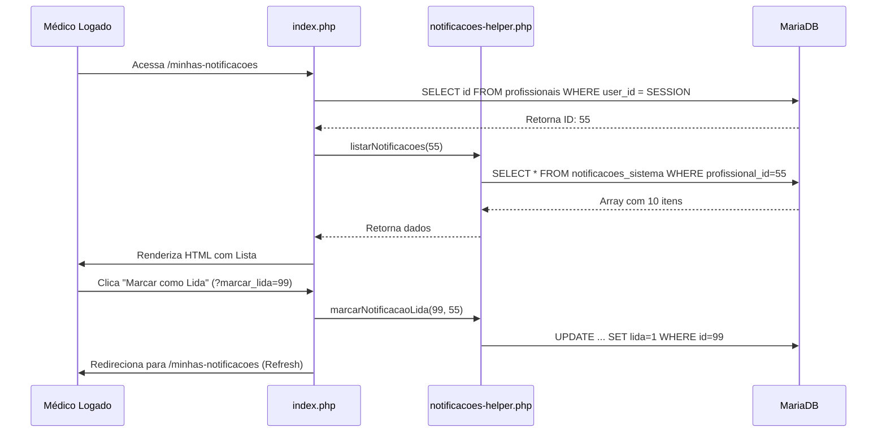

# Módulo Minhas Notificações - Documentação Técnica Detalhada

## 1. Mapa de Arquivos
O módulo é composto pelos seguintes arquivos e dependências diretas:

| Arquivo | Localização | Responsabilidade |
|---|---|---|
| **Controlador/View** | `modules/minhas-notificacoes/index.php` | Ponto de entrada. Gerencia a interface do usuário, processa ações GET (marcar lida) e renderiza a lista. |
| **Biblioteca Global** | `includes/notificacoes-helper.php` | Contém todas as funções de acesso a dados (SQL) e regras de negócio. Compartilhado com outros módulos. |
| **Roteamento** | `.htaccess` | Define a rota amigável `/minhas-notificacoes`. |
| **Estilos** | `assets/css/style.css` (Bootstrap) | Usa classes padrão do Bootstrap e Bootstrap Icons. |

---

## 2. Detalhamento dos Arquivos

### A. Arquivo: `modules/minhas-notificacoes/index.php`
Este arquivo atua como **Full Stack** (Lógica + Apresentação).

**Responsabilidades:**
1.  **Segurança e Autenticação:**
    *   Verifica se o usuário tem permissão (`checkPermission`).
    *   Identifica o ID do Profissional associado à sessão atual (converte `user_id` -> `profissional_id`).
    *   *Redireciona para o Dashboard se o usuário não for um profissional válido.*

2.  **Processamento de Ações (Controller):**
    *   **Ação:** `?marcar_lida=ID` -> Chama `marcarNotificacaoLida()` e recarrega a página.
    *   **Ação:** `?marcar_todas=1` -> Chama `marcarTodasLidas()` e recarrega.
    *   **Filtro:** `?filtro=nao_lidas` -> Altera os parâmetros de busca.

3.  **Visualização (View):**
    *   Exibe cabeçalho padrão.
    *   Mostra botões de ação e filtros.
    *   Renderiza a lista de notificações em um loop `foreach`.
    *   Formata datas relativas ("Agora mesmo", "5 minutos atrás").
    *   Renderiza Badges e Botões de Ação para cada item.

---

### B. Arquivo: `includes/notificacoes-helper.php`
Este arquivo é o **Motor (Model/Service)**. Ele não gera HTML, apenas manipula dados.

**Funções Principais:**

| Função | O que faz | Onde é usada |
|---|---|---|
| `criarNotificacao()` | Insere registro em `notificacoes_sistema`. Verifica antes se o usuário permitiu receber este tipo de aviso na tabela de config. | Usada por triggers globais (novo agendamento, cancelamento). |
| `listarNotificacoes($id, $limit, $apenas_nao_lidas)` | Executa `SELECT` ordenado por data decrescente. | Usada no `index.php` para preencher a tela. |
| `contarNotificacoesNaoLidas($id)` | Retorna um inteiro (`COUNT`). | Usada para mostrar o badge no menu e filtros. |
| `marcarNotificacaoLida($notif_id, $prof_id)` | Executa `UPDATE SET lida=1, lida_em=NOW()`. | Usada quando usuário clica no "check". |
| `notificarNovoAgendamento($agendamento_id)` | **Trigger:** Busca dados do agendamento (Paciente, Data, Sala) e monta o texto da mensagem automaticamente chamando `criarNotificacao`. | Módulo de Agendamentos. |
| `obterConfigNotificacoes($id)` | Busca preferências do usuário. Se não existir, cria padrão (Recursiva segura). | Interno do helper. |

---

## 3. Banco de Dados e Relacionamentos

### Tabela: `notificacoes_sistema`
Esta é a tabela fato que acumula o histórico.

*   `id` (PK)
*   `profissional_id` (FK): Quem recebe.
*   `tipo` (Enum/String): Categoria interna ('novo_agendamento', 'cancelamento', 'sistema').
*   `titulo`: Cabeçalho destacado.
*   `mensagem`: Corpo do texto (suporta quebra de linha).
*   `link`: URL de destino (ex: `/agendamentos/123`).
*   `icone`: Classe CSS do ícone (ex: `bi-calendar`).
*   `cor`: Classe contextual Bootstrap (ex: `danger`, `success`).
*   `lida`: Flag (0/1).
*   `created_at`: Timestamp.

### Tabela: `profissionais_notificacoes_config`
Tabela de "Opt-in/Opt-out" para GDPR e preferências.

*   `profissional_id` (PK/FK)
*   `sistema_ativo`: Master switch.
*   `notif_novo_agendamento`: Boolean.
*   `notif_cancelamento`: Boolean.

---

## 4. Fluxograma de Execução

## 5. Pendências e Melhorias Futuras
*   **Limpeza Automática:** Implementar Cron Job para apagar notificações lidas com mais de 30 dias.
*   **Paginação:** Adicionar paginação na lista (atualmente limita em 50 fixos).
*   **Websocket:** Atualizar contagem em tempo real sem refresh (usando polling ou socket).
