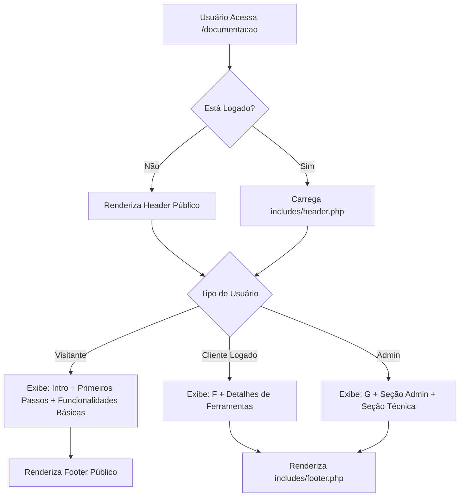
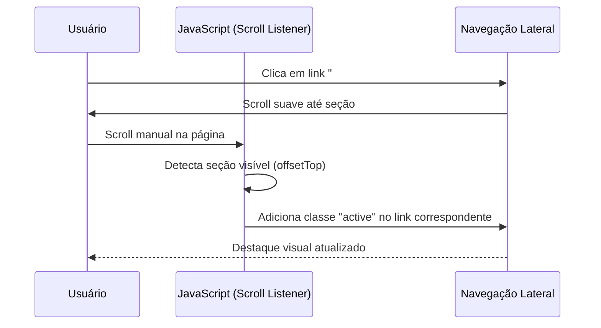

# Documentação Técnica Completa - Módulo Documentação

**Caminho**: `modules/documentacao/`  
**Versão**: 1.0  
**Última Atualização**: Janeiro 2026

---

## 1. Visão Geral

### 1.1. Propósito
O módulo **Documentação** serve como central de ajuda e manual do usuário da plataforma Consulte+. Ele oferece:
- Manual de uso para usuários finais (clientes)
- Documentação administrativa para gestores
- Documentação técnica para desenvolvedores (apenas para admins)
- Acesso público opcional para visitantes não autenticados

### 1.2. Público-Alvo
- **Visitantes Não Autenticados**: Podem visualizar documentação básica do sistema
- **Clientes**: Acesso ao manual completo de uso das funcionalidades
- **Administradores**: Acesso adicional a seções administrativas e técnicas

### 1.3. Principais Funcionalidades
- ✅ Documentação adaptativa baseada no perfil do usuário
- ✅ Navegação por âncoras com scroll spy
- ✅ Suporte a acesso público (sem login)
- ✅ Separação visual clara entre conteúdo público, cliente e admin
- ✅ Renderização de diagramas Mermaid (planejado)

---

## 2. Arquitetura e Estrutura

### 2.1. Visão Hierárquica
```
modules/documentacao/
└── index.php                    # Arquivo único (monolítico)
```

**Observação**: Este é um módulo extremamente simples com apenas 1 arquivo. Toda a lógica, apresentação e controle estão consolidados em `index.php`.

### 2.2. Mapa de Responsabilidades

| Arquivo | Tipo | Responsabilidade Principal | Acesso DB? | Chamadas Externas? |
|:---|:---|:---|:---:|:---:|
| `index.php` | View + Controller | Renderiza documentação completa com seções condicionais | ❌ | ❌ |

**Detalhamento do `index.php`**:
- **Linhas 1-40**: Detecção de usuário logado e determinação de perfil (`$isAdmin`)
- **Linhas 41-136**: CSS inline para estilização da navegação e seções
- **Linhas 138-191**: Sidebar de navegação (adaptativa por perfil)
- **Linhas 193-290**: Conteúdo público (Dashboard, Diagnóstico, Mentorias, Projetos)
- **Linhas 292-374**: Conteúdo administrativo (condicional `if ($isAdmin)`)

---

## 3. Banco de Dados e Persistência

### 3.1. Tabelas Relacionadas
**Nenhuma**. Este módulo é 100% estático e não persiste dados.

### 3.2. Dependências de Dados
Embora não acesse diretamente o banco, o módulo depende de:
- `$_SESSION['user_id']`: Para detectar se há usuário logado
- `$_SESSION['tipo']`: Para determinar se é admin (`['admin', 'superadmin']`)

---

## 4. Fluxos de Dados Críticos

### 4.1. Fluxo de Renderização Condicional



**Pontos Críticos**:
1. **Detecção de Perfil**: Acontece nas linhas 5-11. Se `$_SESSION['tipo']` não existir, assume `public`.
2. **Renderização Condicional**: Usa `<?php if ($isAdmin): ?>` para mostrar/ocultar seções (linhas 296-374).
3. **Fallback de Header**: Se não logado, cria um HTML completo standalone (linhas 16-36).

---

### 4.2. Fluxo de Navegação (Scroll Spy)



**Implementação**: Linhas 569-590 (JavaScript puro, sem dependências).

---

## 5. Integrações e Dependências

### 5.1. Dependências Internas
| Módulo/Arquivo | Propósito | Condicional? |
|:---|:---|:---:|
| `includes/header.php` | Layout padrão do sistema | ✅ (Apenas se logado) |
| `includes/footer.php` | Rodapé padrão | ✅ (Apenas se logado) |
| `site/assets/css/site.css` | Estilos do site público | ✅ (Apenas se NÃO logado) |

### 5.2. Dependências Externas
| Serviço/CDN | Versão | Uso | Carregamento |
|:---|:---|:---|:---|
| Bootstrap CSS | 5.3.0 | Layout e componentes | CDN (apenas se não logado) |
| Bootstrap Icons | 1.7.2 | Ícones | CDN (apenas se não logado) |

**Observação**: Quando o usuário está logado, Bootstrap já vem carregado via `header.php`, então não há duplicação.

### 5.3. Assets Frontend
- **CSS Inline**: Todo o CSS está embutido no `<style>` (linhas 41-136).
- **JavaScript Inline**: Scroll spy implementado em `<script>` (linhas 567-590).

---

## 6. Regras de Negócio Importantes

### 6.1. Controle de Acesso
- **Público**: Qualquer pessoa pode acessar `/documentacao` sem login.
- **Conteúdo Restrito**: Seções "Administrativo" e "Técnico" só aparecem se `$isAdmin === true`.
- **Sem Bloqueio**: Não há `checkPermission()`. O módulo é deliberadamente aberto.

### 6.2. Responsividade
- **Desktop (>992px)**: Navegação lateral fixa (sticky).
- **Mobile (<992px)**: Navegação lateral oculta (`d-none d-lg-block`).

### 6.3. Conteúdo Dinâmico
Atualmente, todo o conteúdo é hardcoded no HTML. Não há:
- Sistema de versionamento de documentação
- Edição via CMS
- Markdown externo

---

## 7. APIs e Endpoints Internos

**Nenhum**. Este módulo não expõe APIs nem processa formulários.

---

## 8. Análise Técnica e Dívida ("To-Do")

### 8.1. Segurança

#### 🟢 BAIXO RISCO
- [ ] **XSS**: Como não há input do usuário nem dados dinâmicos do banco, o risco de XSS é mínimo.
- [ ] **Acesso Público**: Intencional. Não é uma falha de segurança.

### 8.2. Performance

#### 🟡 MÉDIO IMPACTO
- [ ] **CSS/JS Inline**: Todo o CSS (95 linhas) e JS (22 linhas) estão inline. Isso impede cache do navegador.
  
  **Sugestão**: Mover para:
  - `assets/css/documentacao.css`
  - `assets/js/documentacao.js`

- [ ] **Tamanho do HTML**: O arquivo tem 385 linhas. Para um módulo de documentação, isso pode crescer rapidamente.

### 8.3. Organização e Manutenibilidade

#### 🔴 ALTO IMPACTO
- [ ] **Monolítico**: Todo o conteúdo está em um único arquivo PHP de 385 linhas. Dificulta manutenção e versionamento.
  
  **Sugestão**: Separar em:
  ```
  documentacao/
  ├── index.php                 # Controller (lógica de perfil)
  ├── views/
  │   ├── public.php           # Conteúdo para visitantes
  │   ├── user.php             # Conteúdo para clientes
  │   └── admin.php            # Conteúdo administrativo
  └── assets/
      ├── css/docs.css
      └── js/scroll-spy.js
  ```

- [ ] **Conteúdo Hardcoded**: Atualizar a documentação exige editar PHP diretamente. Não há separação entre código e conteúdo.
  
  **Sugestão**: Migrar para Markdown:
  ```
  documentacao/
  └── content/
      ├── intro.md
      ├── dashboard.md
      ├── diagnostico.md
      └── admin/
          ├── gestao-conteudo.md
          └── deploy.md
  ```
  
  Usar biblioteca como `Parsedown` para renderizar.

#### 🟠 MÉDIO IMPACTO
- [ ] **Duplicação de Header**: Linhas 16-36 recriam um header público que provavelmente já existe em `site/index.php`.
  
  **Sugestão**: Criar `includes/public_header.php` reutilizável.

- [ ] **Falta de Busca**: Para documentação extensa, falta funcionalidade de busca (Ctrl+F do navegador é a única opção).

#### 🟢 BAIXO IMPACTO
- [ ] **Navegação Mobile**: Em telas pequenas, a navegação lateral desaparece completamente. Usuários mobile precisam scrollar muito.
  
  **Sugestão**: Adicionar menu hamburguer ou accordion no topo.

### 8.4. Melhorias Sugeridas (Features)

1. **Sistema de Versionamento**: Permitir visualizar documentação de versões antigas do sistema.
   ```
   /documentacao?version=1.0
   /documentacao?version=2.0
   ```

2. **Feedback do Usuário**: Botão "Esta página foi útil?" no final de cada seção.

3. **Exportação PDF**: Gerar PDF da documentação completa (usar biblioteca DomPDF).

4. **Busca Full-Text**: Implementar busca com destaque de termos (usando JS ou backend).

5. **Modo Escuro**: Toggle para alternar entre tema claro/escuro.

6. **Breadcrumbs**: Adicionar navegação hierárquica no topo.

---

## 9. Guia de Troubleshooting

### 9.1. "Página aparece sem estilo"
**Sintomas**: Documentação carrega mas sem CSS do Bootstrap.

**Checklist**:
1. Verificar se CDN do Bootstrap está acessível (testar URL no navegador).
2. Se logado, verificar se `includes/header.php` está carregando Bootstrap corretamente.
3. Checar console do navegador (F12) para erros de carregamento.

### 9.2. "Seção de Admin não aparece"
**Possíveis Causas**:
- `$_SESSION['tipo']` não é `'admin'` ou `'superadmin'`.
- Usuário logou como cliente.

**Solução**: 
```php
// Debug temporário (adicionar na linha 12):
var_dump($_SESSION['tipo'], $isAdmin);
```

### 9.3. "Scroll spy não funciona"
**Causa Comum**: JavaScript não está executando (erro anterior na página).

**Debug**:
1. Abrir DevTools > Console.
2. Verificar se há erros de sintaxe.
3. Testar manualmente: `document.querySelectorAll('.doc-section')` deve retornar elementos.

---

## 10. Roadmap de Refatoração (Priorizado)

### Fase 1 (Urgente - 1 Sprint)
1. ⬜ Extrair CSS e JS para arquivos externos
2. ⬜ Criar `includes/public_header.php` reutilizável
3. ⬜ Adicionar navegação mobile (accordion)

### Fase 2 (Importante - 2 Sprints)
4. ⬜ Separar conteúdo em arquivos Markdown
5. ⬜ Implementar parser Markdown (Parsedown)
6. ⬜ Criar estrutura MVC (Controller + Views)

### Fase 3 (Desejável - 3 Sprints)
7. ⬜ Adicionar sistema de busca
8. ⬜ Implementar versionamento de docs
9. ⬜ Criar exportação PDF

---

## 11. Exemplos de Uso

### 11.1. Adicionar Nova Seção de Documentação

**Passo 1**: Adicionar link na navegação (linha ~170):
```php
<a href="#nova-secao">Minha Nova Seção</a>
```

**Passo 2**: Criar a seção no conteúdo (linha ~290):
```php
<div class="doc-section" id="nova-secao">
    <div class="card-header">
        <h4><i class="bi bi-star me-2"></i>Minha Nova Seção</h4>
    </div>
    <div class="card-body">
        <p>Conteúdo aqui...</p>
    </div>
</div>
```

**Passo 3**: (Opcional) Tornar condicional para admin:
```php
<?php if ($isAdmin): ?>
    <!-- Seção aqui -->
<?php endif; ?>
```

---

### 11.2. Customizar Estilos

**Localização**: Linhas 41-136 (bloco `<style>`).

**Exemplo - Mudar cor do link ativo**:
```css
.doc-nav a.active {
    color: #ff6b6b;  /* Era #0d6efd */
    border-left-color: #ff6b6b;
}
```

---

## 12. Métricas e Monitoramento

### 12.1. Métricas Sugeridas (Não Implementadas)
- **Pageviews**: Quantas vezes a documentação foi acessada.
- **Seções Mais Visitadas**: Quais âncoras são mais clicadas.
- **Taxa de Saída**: % de usuários que saem após ler a documentação.
- **Tempo Médio na Página**: Indica se a documentação é útil ou confusa.

**Implementação Sugerida**: Google Analytics ou Matomo.

---

## 13. Contatos e Referências

**Responsável pelo Conteúdo**: [Equipe de Produto]  
**Responsável Técnico**: [Dev Backend]  
**Última Grande Atualização**: Janeiro 2026 (Separação Admin/User)

**Links Relacionados**:
- [Documentação N8N (IA)](#) - Para entender integrações
- [Guia de Estilo Bootstrap](https://getbootstrap.com/docs/5.3/) - Referência de componentes

---

## 14. Changelog

| Data | Versão | Mudanças |
|:---|:---|:---|
| 24/01/2026 | 1.2 | Adicionada separação de conteúdo Admin/User |
| 11/01/2026 | 1.1 | Implementado scroll spy |
| 05/01/2026 | 1.0 | Versão inicial |

---

*Documento vivo. Última revisão: 24/01/2026*
